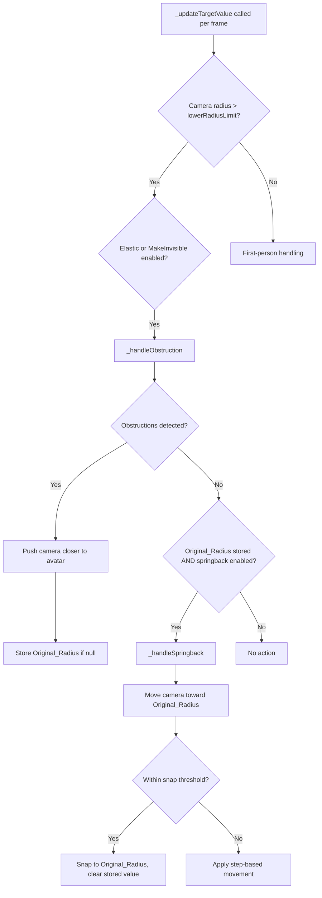
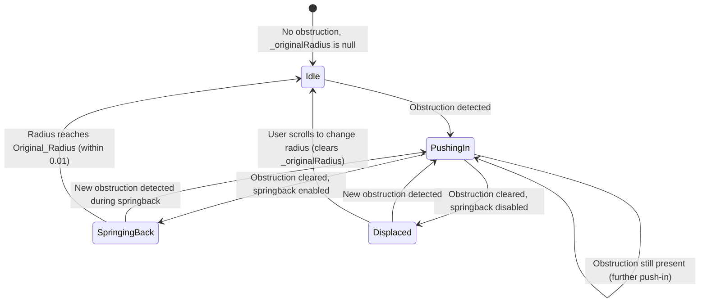

# Design Document

## Overview

This design adds springback recovery to the existing elastic camera obstruction system in the `CharacterController` class. The current implementation pushes the camera closer to the avatar when an obstruction is detected but never recovers the original distance. The springback feature introduces automatic, smooth recovery toward the pre-obstruction radius once the obstruction clears, using the same step-based deceleration approach already employed for push-in.

The feature integrates directly into the existing `_handleObstruction()` method and the per-frame `_updateTargetValue()` call site. It adds minimal new state (original radius, springback enabled flag, springback steps) and follows the established patterns of the library: private `_` prefixed members, public setter/getter methods, and persistence via `CCSettings`.

## Architecture

The springback logic lives entirely within the existing `CharacterController` class, consistent with the single-file architecture. No new classes or files are introduced.



### Key Design Decisions

1. **Springback as a branch within `_handleObstruction`**: Rather than a separate per-frame call, springback executes in the "no obstruction" branch of the existing elastic camera logic. This ensures mutual exclusivity — the camera is either being pushed in or springing back, never both simultaneously.

2. **Same deceleration formula**: Springback uses `remainingDistance / springbackSteps` per frame, producing the same decelerating motion as push-in. This gives a consistent feel.

3. **Separate step count**: Springback has its own `_springbackSteps` (default 50) independent of `_elasticSteps`, allowing developers to tune recovery speed separately from approach speed.

4. **Dual-mode support**: When `camera.checkCollisions` is true, springback moves the camera position along the avatar-to-camera vector. When false, it increases `camera.radius`. This mirrors the existing push-in dual-mode behavior.

5. **Re-obstruction during springback**: If an obstruction is detected while springing back, the push-in logic takes over immediately. The stored `_originalRadius` is preserved so recovery can resume later.

## Components and Interfaces

### New Private Members

| Member | Type | Default | Description |
|--------|------|---------|-------------|
| `_springback` | `boolean` | `true` | Whether springback recovery is enabled |
| `_springbackSteps` | `number` | `50` | Number of deceleration steps for springback |
| `_originalRadius` | `number \| null` | `null` | Camera radius before obstruction push-in began; null means no displacement |

### New Public Methods

```typescript
/**
 * Enable or disable automatic camera springback after obstruction clears.
 */
public setCameraElasticSpringback(b: boolean): void;

/**
 * Returns whether springback is currently enabled.
 */
public isCameraElasticSpringback(): boolean;

/**
 * Set the number of deceleration steps for springback recovery.
 * Values < 1 are clamped to 1.
 */
public setSpringbackSteps(n: number): void;
```

### Modified Methods

| Method | Change |
|--------|--------|
| `_handleObstruction()` | Store `_originalRadius` before first push-in; add springback branch when no obstruction detected |
| `_updateTargetValue()` | Clear `_originalRadius` when radius matches original (within tolerance); detect user-initiated radius changes |
| `getSettings()` | Include `springback` and `springbackSteps` in returned `CCSettings` |
| `setSettings()` | Apply `springback` and `springbackSteps` from `CCSettings` if present |

### Modified Classes

| Class | Change |
|-------|--------|
| `CCSettings` | Add `springback?: boolean` and `springbackSteps?: number` properties |

## Data Models

### State Machine

The camera elastic system operates as a simple state machine:



### CCSettings Extension

```typescript
export class CCSettings {
    // ... existing properties ...
    public springback?: boolean;       // undefined means "keep current"
    public springbackSteps?: number;   // undefined means "keep current"
}
```

The optional typing ensures backward compatibility — existing serialized `CCSettings` objects without these properties will not overwrite current values when restored.

### Springback Step Calculation

Each frame during springback:

```
remainingDistance = _originalRadius - camera.radius
stepSize = remainingDistance / _springbackSteps

if (remainingDistance <= 1.0):
    snap camera.radius to _originalRadius
    set _originalRadius = null
else:
    camera.radius += stepSize
```

For `checkCollisions` mode, the same formula applies but operates on the camera position vector magnitude rather than the radius scalar.

### User Radius Change Detection

When the user scrolls (changing radius via input), the controller detects this by comparing the current radius against the expected radius from the previous frame. If the radius changed by more than the springback step or push-in step would produce, it's treated as a user-initiated change, and `_originalRadius` is updated to the new user-requested radius.

## Correctness Properties

*A property is a characteristic or behavior that should hold true across all valid executions of a system — essentially, a formal statement about what the system should do. Properties serve as the bridge between human-readable specifications and machine-verifiable correctness guarantees.*

### Property 1: Original radius capture and invariant

*For any* camera radius R > 0 and any sequence of obstruction-driven push-in events, the stored `_originalRadius` SHALL equal the camera radius at the moment of the first push-in, and SHALL remain unchanged across all subsequent push-in events until explicitly cleared.

**Validates: Requirements 1.1, 1.2**

### Property 2: Original radius cleared at convergence threshold

*For any* stored `_originalRadius` value and current camera radius where `|currentRadius - _originalRadius| <= 0.01`, the system SHALL set `_originalRadius` to null.

**Validates: Requirements 1.3**

### Property 3: User radius change updates recovery target

*For any* non-null `_originalRadius` and any user-initiated radius change to a new value R, the stored `_originalRadius` SHALL be updated to R.

**Validates: Requirements 1.4**

### Property 4: Springback step formula produces decelerating motion

*For any* remaining distance D > 1 and springback steps S >= 1, the per-frame step size SHALL equal D / S, and after applying the step the new remaining distance SHALL be D - (D / S) = D * (S-1) / S, which is strictly less than D.

**Validates: Requirements 2.2, 4.4**

### Property 5: Springback snap at threshold

*For any* current radius and original radius where 0 < (originalRadius - currentRadius) <= 1, the springback SHALL snap the camera radius directly to the original radius (offset by cameraSkin in collision mode) rather than applying the step formula.

**Validates: Requirements 2.3, 5.4**

### Property 6: Obstruction during springback triggers push-in and preserves original radius

*For any* springback-in-progress state (currentRadius < _originalRadius, no obstruction) followed by a new obstruction detection, the system SHALL immediately apply push-in behavior (reducing radius toward the obstruction) AND the stored `_originalRadius` SHALL remain unchanged.

**Validates: Requirements 2.4, 3.1, 3.2**

### Property 7: Springback resumes after interruption clears

*For any* state where springback was interrupted by an obstruction, when that obstruction is no longer detected, the system SHALL resume springback movement toward the same stored `_originalRadius` that was set before the interruption.

**Validates: Requirements 3.3**

### Property 8: Springback steps clamping

*For any* numeric value N < 1 passed to `setSpringbackSteps`, the stored springback steps value SHALL be clamped to 1.

**Validates: Requirements 4.3**

### Property 9: Collision-mode springback moves camera position along correct vector

*For any* camera with `checkCollisions = true`, target position T, current camera position P, and stored original position, the springback SHALL move the camera position away from T along the normalized direction (P - T), increasing the distance from T toward the original distance.

**Validates: Requirements 5.1**

### Property 10: Radius-mode springback increases camera radius

*For any* camera with `checkCollisions = false` and current radius < `_originalRadius`, when no obstruction is detected, the springback SHALL increase `camera.radius` toward `_originalRadius`.

**Validates: Requirements 5.2**

### Property 11: Disabled springback or disabled elastic prevents recovery

*For any* displaced camera state (currentRadius < _originalRadius) with no obstruction, IF springback is disabled OR elastic camera is disabled, THEN the camera radius SHALL remain unchanged across frames.

**Validates: Requirements 6.3, 6.4**

### Property 12: Settings round-trip preserves springback configuration

*For any* springback enabled state (boolean) and springback steps value (integer in [1, 1000]), saving settings via `getSettings()` and restoring via `setSettings()` SHALL produce the same springback enabled state and springback steps value.

**Validates: Requirements 7.1, 7.2**

### Property 13: Settings backward compatibility

*For any* current springback state, restoring a `CCSettings` object that does not contain `springback` or `springbackSteps` properties SHALL leave the current springback enabled state and steps value unchanged.

**Validates: Requirements 7.3**

### Property 14: Settings value constraint

*For any* numeric value passed as `springbackSteps` during save or restore, the stored value SHALL be an integer clamped to the range [1, 1000] inclusive.

**Validates: Requirements 7.4**

## Error Handling

| Scenario | Handling |
|----------|----------|
| `setSpringbackSteps` called with value < 1 | Clamp to 1 |
| `setSpringbackSteps` called with value > 1000 | Clamp to 1000 |
| `setSpringbackSteps` called with non-integer | Floor to nearest integer, then clamp |
| `_originalRadius` is null when springback check runs | No springback action (normal idle state) |
| Camera radius exceeds `_originalRadius` during springback (e.g., user scrolled out) | Clear `_originalRadius` to null — no recovery needed |
| `setCameraElasticity(false)` called while springback in progress | Springback stops immediately; `_originalRadius` is cleared |
| `CCSettings` restored without springback properties | Retain current values (no-op for springback fields) |
| Camera enters first-person mode (radius <= lowerRadiusLimit) | Springback is not active in first-person; `_originalRadius` preserved for when camera exits first-person |

## Testing Strategy

### Property-Based Tests (fast-check + vitest)

The springback logic is primarily pure computation (step calculations, state transitions, clamping) that can be extracted into testable functions, following the same pattern used in existing tests (e.g., `rotation-convergence.test.ts`).

**Library**: fast-check (already installed as devDependency)
**Framework**: vitest (already configured)
**Minimum iterations**: 100 per property test (configured via `{ numRuns: 100 }`)

Each property test will:
- Extract the pure logic into a standalone function mirroring the implementation
- Generate random inputs covering the full valid range
- Assert the property holds for all generated inputs
- Be tagged with: `Feature: elastic-camera-springback, Property {N}: {title}`

### Unit Tests (example-based)

| Test | Validates |
|------|-----------|
| Default `_springback` is `true` | Req 6.2 |
| Default `_springbackSteps` is `50` | Req 4.2 |
| `setCameraElasticSpringback` / `isCameraElasticSpringback` round-trip | Req 6.1 |
| `setSpringbackSteps` stores value correctly | Req 4.1 |

### Test File Organization

```
tests/
  elastic-springback-step-formula.test.ts      # Properties 4, 5
  elastic-springback-state-tracking.test.ts    # Properties 1, 2, 3, 6, 7
  elastic-springback-modes.test.ts             # Properties 9, 10, 11
  elastic-springback-settings.test.ts          # Properties 8, 12, 13, 14
```

### Testing Approach

Following the established pattern in this codebase, tests extract the pure logic from the `CharacterController` into standalone functions that mirror the implementation. This avoids needing to instantiate BabylonJS scene objects (Mesh, ArcRotateCamera, Scene) in unit tests. The extracted functions are tested with fast-check property generators, and the integration between extracted logic and the controller is verified by the existing manual test pages.

