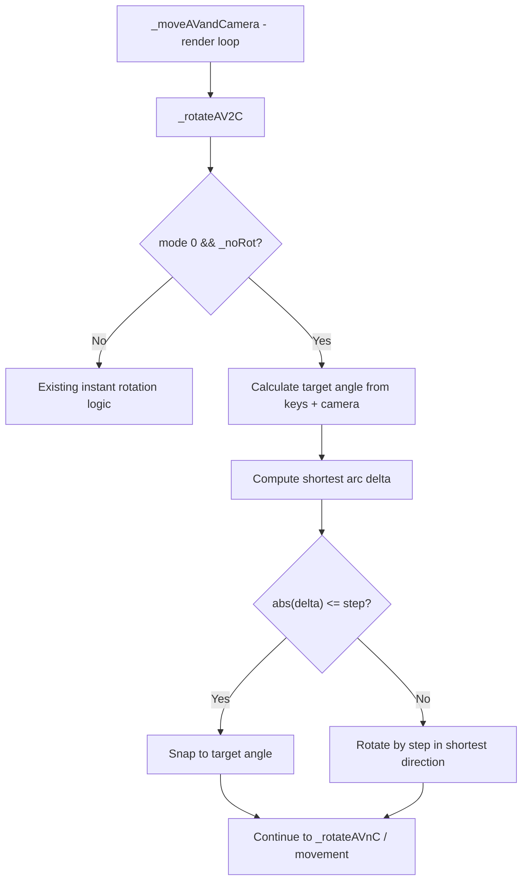

# Design Document: Smooth Turning

## Overview

This feature replaces the instant avatar rotation snap in `_rotateAV2C()` with a gradual interpolation toward the target angle when `turningOff` is enabled in mode 0. Currently, pressing a directional key (left, right, back, or diagonal combinations) immediately sets the avatar's Y rotation to the target direction. With smooth turning, the avatar rotates incrementally each frame at a configurable speed (degrees per second), following the shortest arc to the target.

The implementation modifies the existing `_rotateAV2C()` method to use frame-rate-independent interpolation (`speed * deltaTime`) and adds a new configurable parameter (`_smoothTurnSpeed`) with getter/setter methods integrated into the existing `CCSettings` API.

## Architecture

The smooth turning logic lives entirely within the existing `CharacterController` class in `src/CharacterController.ts`. No new files or classes are introduced.



The change is localized to:
1. A new private field `_smoothTurnSpeed` (stored in radians/sec)
2. Public `setSmoothTurnSpeed()` / `getSmoothTurnSpeed()` methods
3. Modified `_rotateAV2C()` method — the `_noRot` branch uses incremental rotation instead of instant assignment
4. Updated `CCSettings` class and `getSettings()` / `setSettings()` methods

## Components and Interfaces

### New Public API

```typescript
// Set smooth turn speed in degrees per second. Ignores zero, negative, NaN, Infinity.
public setSmoothTurnSpeed(speed: number): void

// Get current smooth turn speed in degrees per second.
public getSmoothTurnSpeed(): number
```

### Modified Internal Method

```typescript
// _rotateAV2C() — the _noRot branch changes from:
//   this._setAvatarRotationY(targetAngle)
// to:
//   incrementally rotate toward targetAngle using _smoothTurnSpeed * dt
private _rotateAV2C(): void
```

### Updated CCSettings

```typescript
export class CCSettings {
    // ... existing properties ...
    public smoothTurnSpeed: number;  // degrees per second
}
```

### Target Angle Calculation

The target angle is computed from the camera alpha and the combination of pressed keys:

| Keys Pressed       | Target Angle (relative to camera forward) |
|--------------------|-------------------------------------------|
| Forward            | 0°                                        |
| Forward + Left     | -45° (left)                               |
| Forward + Right    | +45° (right)                              |
| Left               | -90° (left)                               |
| Right              | +90° (right)                              |
| Back + Left        | -135° (left)                              |
| Back + Right       | +135° (right)                             |
| Back               | 180°                                      |

The sign convention follows the existing `_rhsSign` multiplier for right-hand vs left-hand system compatibility.

### Shortest Arc Rotation

Given current angle `c` and target angle `t`, the signed shortest arc delta is:

```typescript
let delta = t - c;
// Normalize to [-PI, PI]
while (delta > Math.PI) delta -= 2 * Math.PI;
while (delta < -Math.PI) delta += 2 * Math.PI;
```

The rotation step per frame is `min(|delta|, _smoothTurnSpeed * dt)`, applied in the direction of `sign(delta)`.

## Data Models

### New Private State

```typescript
// Default: 120 deg/s = 2π/3 rad/s
private _smoothTurnSpeed: number = 2 * Math.PI / 3;
```

No new classes or data structures are needed. The feature adds one numeric field to `CharacterController` and one to `CCSettings`.

### State Transitions

The smooth turning has no explicit state machine — it is stateless per frame. Each frame:
1. Compute target angle from keys + camera
2. Compute delta from current to target (shortest arc)
3. Apply `min(|delta|, speed * dt)` rotation toward target

When keys are released, `_rotateAV2C()` is no longer called (the `_noRot` branch only executes when directional keys are active), so rotation naturally stops at whatever angle the avatar has reached.

## Correctness Properties

*A property is a characteristic or behavior that should hold true across all valid executions of a system — essentially, a formal statement about what the system should do. Properties serve as the bridge between human-readable specifications and machine-verifiable correctness guarantees.*

### Property 1: Speed parameter round-trip

*For any* positive finite number `s`, calling `setSmoothTurnSpeed(s)` and then `getSmoothTurnSpeed()` SHALL return `s`. Additionally, for any valid CCSettings object with `smoothTurnSpeed = s`, calling `setSettings(ccs)` then `getSettings()` SHALL return a CCSettings whose `smoothTurnSpeed` equals `s`.

**Validates: Requirements 1.2, 1.3, 1.4, 4.2, 4.3, 4.4**

### Property 2: Invalid input rejection

*For any* value `v` that is zero, negative, NaN, or Infinity, calling `setSmoothTurnSpeed(v)` SHALL leave `getSmoothTurnSpeed()` unchanged from its value before the call.

**Validates: Requirements 1.5**

### Property 3: Rotation convergence

*For any* current avatar rotation `c`, target angle `t`, smooth turn speed `s > 0`, and delta time `dt > 0`: if the shortest-arc angular difference `d = shortestArc(c, t)` satisfies `|d| > s * dt`, then after one frame the avatar rotation SHALL change by exactly `s * dt` toward `t`. If `|d| <= s * dt`, the avatar rotation SHALL equal `t` exactly (snap to prevent overshoot).

**Validates: Requirements 2.1, 2.2**

### Property 4: Shortest arc direction

*For any* current avatar rotation `c` and target angle `t`, the rotation applied by smooth turning SHALL always be in the direction of the shortest arc, meaning the absolute angular change is at most π radians from `c` to `t`.

**Validates: Requirements 2.3**

### Property 5: Movement direction during smooth turn

*For any* avatar orientation during smooth turning, the horizontal displacement vector SHALL be aligned with the avatar's current forward direction (not the target direction), scaled by walk speed × dt (or run speed × dt if the speed modifier is held).

**Validates: Requirements 3.1**

## Error Handling

| Scenario | Handling |
|----------|----------|
| `setSmoothTurnSpeed(0)` | Ignored, retain previous value |
| `setSmoothTurnSpeed(-5)` | Ignored, retain previous value |
| `setSmoothTurnSpeed(NaN)` | Ignored, retain previous value |
| `setSmoothTurnSpeed(Infinity)` | Ignored, retain previous value |
| `dt = 0` (first frame) | Rotation step is 0, no rotation applied — avatar stays in place |
| Mode changed mid-rotation | Smooth rotation stops immediately; new mode's logic takes over |
| `turningOff` toggled mid-rotation | Smooth rotation stops; instant rotation (or no rotation) resumes |

No exceptions are thrown. Invalid inputs are silently ignored following the existing library convention (e.g., `setSound(null)` returns early).

## Testing Strategy

### Unit Tests (Example-Based)

Since this project has no automated test framework, the testing strategy introduces a lightweight test setup:

- **Framework**: Vitest (fast, TypeScript-native, works with the existing tsconfig)
- **Approach**: Test the pure rotation logic by extracting or mocking the minimal dependencies (avatar rotation state, camera alpha, delta time)

Example-based tests should cover:
1. Default smooth turn speed is 120 deg/s
2. Each key combination produces the correct target angle (8 cases from Req 2.4–2.11)
3. Key release mid-turn stops rotation (Req 3.2)
4. Walk/run animation selection during turn (Req 3.3)
5. Mode 0 with turningOff=false still snaps instantly (Req 5.1)
6. Mode 1 is unaffected by smoothTurnSpeed (Req 5.2)
7. Mode/turningOff change mid-rotation stops smooth turn (Req 5.3)

### Property-Based Tests

- **Library**: fast-check (with Vitest)
- **Minimum iterations**: 100 per property
- **Tag format**: `Feature: smooth-turning, Property {N}: {title}`

Each correctness property (1–5) maps to one property-based test:
1. Round-trip: generate random positive finite numbers, verify set/get identity
2. Invalid rejection: generate invalid numbers (zero, negatives, NaN, ±Infinity), verify no change
3. Convergence: generate random angles and speeds, verify step size or snap behavior
4. Shortest arc: generate random angle pairs, verify direction choice
5. Movement direction: generate random orientations, verify displacement alignment

### Manual Integration Tests

Using the existing `tst/` HTML test pages:
- Visual verification that the avatar rotates smoothly when pressing left/right/back
- Verify diagonal key combos produce 45°/135° targets
- Verify speed modifier (shift) affects movement speed but not turn speed
- Verify mode switching mid-turn behaves correctly
