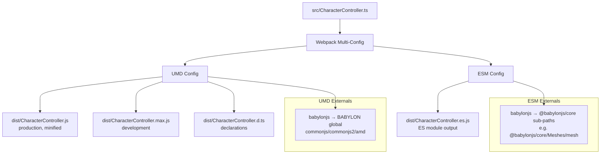

# Design Document: Dual Module Format Support

## Overview

This design adds ES6 module (ESM) output to the BabylonJS-CharacterController build pipeline alongside the existing UMD output. The key challenge is that the source imports from the monolithic `babylonjs` package, but ESM consumers use `@babylonjs/core` with granular sub-path imports (e.g., `@babylonjs/core/Meshes/mesh`). The build system must produce both formats from a single source file without duplication or conditional compilation.

**Approach**: Webpack 5 supports exporting an array of configurations, allowing multiple builds from the same entry point. The UMD configuration remains unchanged. A second ESM configuration uses `experiments.outputModule` with `output.library.type = "module"` and a custom externals function that rewrites `babylonjs` imports to their corresponding `@babylonjs/core` sub-paths.

## Architecture



### Design Decisions

1. **Webpack multi-config array** over separate build tools (Rollup, esbuild): Keeps the existing toolchain intact, avoids new dependencies, and ensures both outputs share identical compilation settings.

2. **Import rewriting via externals function** over source transforms: The source continues to import from `"babylonjs"`. The ESM webpack config uses a function-based externals that maps each imported symbol to its `@babylonjs/core` sub-path at bundle time. This avoids modifying the source file or maintaining a separate entry point.

3. **Static import map** over dynamic resolution: A hardcoded mapping object from BabylonJS type names to `@babylonjs/core` sub-paths is more reliable than attempting to resolve paths at build time from `node_modules`. The map only needs entries for the ~25 types actually imported by the library.

4. **Single declaration file** shared by both formats: TypeScript declarations are generated once (by the UMD build) and referenced by both `main` and `module` entry points. The types are identical regardless of module format.

## Components and Interfaces

### 1. Webpack Configuration (`webpack.config.js`)

The config file exports an array of two configurations:

**UMD Configuration** (unchanged):
- `output.libraryTarget: "umd"`
- `externals`: babylonjs mapped to commonjs/commonjs2/amd/root
- `optimization`: TerserPlugin with `_` prefix mangling
- Produces `CharacterController.js` (prod) and `CharacterController.max.js` (dev)

**ESM Configuration** (new):
- `experiments.outputModule: true`
- `output.library.type: "module"`
- `output.filename: "CharacterController.es.js"`
- `output.module: true`
- `externalsType: "module"`
- `externals`: function that rewrites `babylonjs` to `@babylonjs/core` sub-paths
- No TerserPlugin (ESM consumers will tree-shake and minify in their own build)

### 2. Import Map Module (`webpack.es-externals.js`)

A mapping object that translates each BabylonJS type imported by the source to its `@babylonjs/core` sub-path:

```javascript
// Maps: type name → @babylonjs/core sub-path
const BABYLONJS_ES6_MAP = {
  "Skeleton": "@babylonjs/core/Bones/skeleton",
  "ArcRotateCamera": "@babylonjs/core/Cameras/arcRotateCamera",
  "Vector3": "@babylonjs/core/Maths/math.vector",
  "Mesh": "@babylonjs/core/Meshes/mesh",
  "Node": "@babylonjs/core/node",
  "Scene": "@babylonjs/core/scene",
  "Ray": "@babylonjs/core/Culling/ray",
  "PickingInfo": "@babylonjs/core/Collisions/pickingInfo",
  "AnimationGroup": "@babylonjs/core/Animations/animationGroup",
  "TransformNode": "@babylonjs/core/Meshes/transformNode",
  "TargetedAnimation": "@babylonjs/core/Animations/animationGroup",
  "Matrix": "@babylonjs/core/Maths/math.vector",
  "DeepImmutable": "@babylonjs/core/types",
  "AbstractMesh": "@babylonjs/core/Meshes/abstractMesh",
  "PlaySoundAction": "@babylonjs/core/Actions/directActions",
  "InstancedMesh": "@babylonjs/core/Meshes/instancedMesh",
  "Sound": "@babylonjs/core/Audio/sound",
  "AnimationRange": "@babylonjs/core/Animations/animationRange",
  "Animatable": "@babylonjs/core/Animations/animatable",
  "AnimationEvent": "@babylonjs/core/Animations/animationEvent",
  "int": "@babylonjs/core/types",
  "LinesMesh": "@babylonjs/core/Meshes/linesMesh",
  "MeshBuilder": "@babylonjs/core/Meshes/meshBuilder",
  "Color3": "@babylonjs/core/Maths/math.color",
  "Quaternion": "@babylonjs/core/Maths/math.vector"
};
```

### 3. Package Manifest (`package.json`)

Updated fields:

```json
{
  "main": "dist/CharacterController.js",
  "module": "dist/CharacterController.es.js",
  "types": "dist/CharacterController.d.ts",
  "exports": {
    ".": {
      "types": "./dist/CharacterController.d.ts",
      "import": "./dist/CharacterController.es.js",
      "require": "./dist/CharacterController.js"
    }
  },
  "peerDependencies": {
    "babylonjs": "^8.0.0",
    "@babylonjs/core": "^8.0.0"
  },
  "peerDependenciesMeta": {
    "babylonjs": { "optional": true },
    "@babylonjs/core": { "optional": true }
  }
}
```

### 4. TypeScript Configuration

No changes needed. The existing `tsconfig.json` already uses `"module": "es2015"` and `"declaration": true`. Webpack's ts-loader handles compilation for both configs using the same tsconfig.

## Data Models

This feature does not introduce runtime data models. The changes are entirely in build configuration and package metadata.

**Build Artifacts** (output files):

| File | Format | Purpose |
|------|--------|---------|
| `dist/CharacterController.js` | UMD, minified | Production bundle for `babylonjs` consumers |
| `dist/CharacterController.max.js` | UMD, unminified | Development bundle for `babylonjs` consumers |
| `dist/CharacterController.es.js` | ESM | Bundle for `@babylonjs/core` consumers |
| `dist/CharacterController.d.ts` | TypeScript declarations | Shared type definitions |

**Import Map Structure** (build-time only):

```typescript
type ImportMap = Record<string, string>;
// key: BabylonJS type name (e.g., "Vector3")
// value: @babylonjs/core sub-path (e.g., "@babylonjs/core/Maths/math.vector")
```

## Correctness Properties

*A property is a characteristic or behavior that should hold true across all valid executions of a system — essentially, a formal statement about what the system should do. Properties serve as the bridge between human-readable specifications and machine-verifiable correctness guarantees.*

### Property 1: Import map completeness

*For any* named import of a BabylonJS type in the source file `src/CharacterController.ts`, the import map SHALL contain a corresponding entry mapping that type name to a valid `@babylonjs/core` sub-path, ensuring the ESM build can resolve all externals.

**Validates: Requirements 2.1, 2.2**

### Property 2: Package entry point consistency

*For any* file path referenced in the `package.json` fields (`main`, `module`, `types`, and `exports` conditions), that path SHALL resolve to an existing file in the `dist/` directory after a production build completes.

**Validates: Requirements 4.1, 4.2, 4.3, 4.4, 4.5**

### Property 3: ESM output contains only external references to @babylonjs/core

*For any* import statement in the ESM bundle output (`dist/CharacterController.es.js`), the import source SHALL match the pattern `@babylonjs/core/*` and SHALL NOT reference the monolithic `babylonjs` package.

**Validates: Requirements 2.1, 2.3, 2.4**

## Error Handling

### Build Errors

| Scenario | Handling |
|----------|----------|
| Missing type in import map | Webpack build fails with "unresolved external" error for the ESM config. The developer must add the missing type to the import map. |
| Invalid `@babylonjs/core` sub-path | Consumer's bundler fails at their build time with "module not found". Validated by integration tests that verify each mapped path resolves. |
| `experiments.outputModule` not supported | Only affects webpack versions < 5.x. The project already pins webpack ^5.75.0, so this is not a concern. |
| Declaration file conflicts | Only one config generates declarations (UMD config). The ESM config skips declaration generation to avoid conflicts. |

### Consumer Errors

| Scenario | Handling |
|----------|----------|
| Consumer installs neither `babylonjs` nor `@babylonjs/core` | npm/yarn warns about unmet peer dependencies. Runtime fails with "module not found" at import time. |
| Consumer installs both packages | No conflict — the `module` field routes ESM bundlers to the ES6 output, `main` routes CJS/script consumers to UMD. Only one external set is resolved per consumer. |
| Version mismatch between peer dependency and installed version | Peer dependency uses `^8.0.0` range. npm warns if the installed version doesn't satisfy the range. |

## Testing Strategy

### Why Property-Based Testing Does Not Apply

This feature is primarily build configuration and package metadata. The acceptance criteria test:
- Whether specific files exist after a build (smoke tests)
- Whether output files have correct format/content (integration tests)
- Whether package.json has correct field values (example-based unit tests)
- Whether the webpack config has correct structure (example-based unit tests)

The only candidate for PBT was the import map (mapping type names to `@babylonjs/core` sub-paths). However, this is a static 25-entry lookup table — not a function with a large or infinite input space. Running 100 iterations on a fixed map provides no additional coverage over checking each entry once. PBT is not cost-effective here.

### Test Approach

**1. Integration Tests (post-build verification)**

Run the actual webpack build and verify outputs:
- `dist/CharacterController.js` exists and is minified UMD
- `dist/CharacterController.max.js` exists and is unminified UMD
- `dist/CharacterController.es.js` exists and contains ESM syntax
- `dist/CharacterController.d.ts` exists
- UMD output references `BABYLON` global
- ESM output contains `import` statements from `@babylonjs/core` sub-paths
- Neither bundle contains BabylonJS internal code (bundle size check)
- UMD output has mangled `_`-prefixed properties

**2. Unit Tests (configuration and metadata)**

Verify webpack config structure without running a build:
- UMD config has `libraryTarget: "umd"` and correct externals shape
- ESM config has `experiments.outputModule: true` and `output.library.type: "module"`
- Import map covers all types imported in `src/CharacterController.ts`
- Each import map entry follows `@babylonjs/core/...` pattern

Verify package.json fields:
- `main` points to UMD bundle
- `module` points to ESM bundle
- `types` points to declaration file
- `exports` has correct `import`/`require`/`types` conditions
- `peerDependencies` declares both packages with `^8.0.0`
- `peerDependenciesMeta` marks both as optional
- All referenced paths exist after build

**3. Smoke Tests**

- Source file has no conditional compilation directives
- Source file uses only named imports from `"babylonjs"`
- Build commands (`npm run build`, `npm run build-dev`) exit with code 0

### Test Framework

- **Vitest** (already configured) for unit and integration tests
- Tests in `tests/` directory following existing conventions
- No new test dependencies needed

