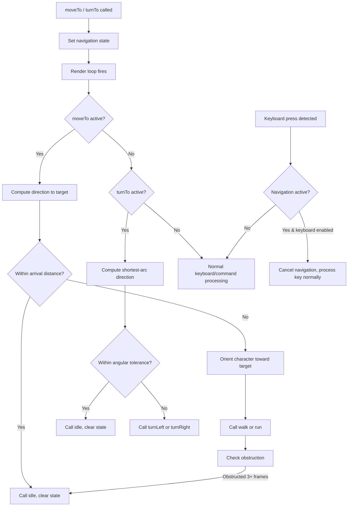
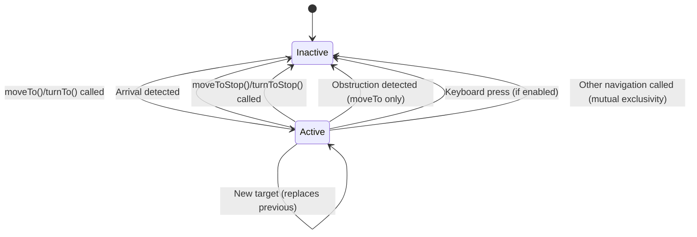

# Design Document: moveTo / turnTo

## Overview

This design adds two high-level navigation APIs — `moveTo()` and `turnTo()` — to the `CharacterController` class. These APIs provide goal-oriented movement and rotation that build on the existing low-level command APIs (`walk()`, `run()`, `turnLeft()`, `turnRight()`, `idle()`).

The key design principle is **composition over reimplementation**: `moveTo` and `turnTo` orchestrate the existing command infrastructure rather than bypassing it. Each frame, the navigation logic computes the desired action and issues the appropriate low-level command. This ensures animations, collision handling, and camera behavior continue to work unchanged.

### Design Goals

- Minimal invasiveness: add new state and logic without restructuring existing code
- Frame-level integration: navigation decisions happen in the existing `_moveAVandCamera()` render loop
- Clean cancellation: keyboard input, manual commands, and explicit stop calls all cancel operations immediately
- Testability: core logic (direction computation, arrival detection, obstruction detection) is extractable as pure functions

## Architecture

The feature integrates into the existing single-file architecture by adding:

1. **Navigation state fields** on `CharacterController` (prefixed with `_moveTo` and `_turnTo`)
2. **Public API methods** (`moveTo()`, `moveToStop()`, `turnTo()`, `turnToStop()`)
3. **Per-frame update logic** called from the existing render loop (`_moveAVandCamera()`)
4. **Keyboard interrupt hooks** in the existing `_onKeyDown()` handler



### moveTo + turnTo Mutual Exclusivity

`moveTo` and `turnTo` are **mutually exclusive** operations. Calling `moveTo()` cancels any active `turnTo`, and calling `turnTo()` cancels any active `moveTo`. Only one navigation operation can be active at a time.

**Rationale:** In mode 0, the camera controls avatar rotation, which conflicts with both moveTo (which sets rotation toward the target) and turnTo (which rotates via turn commands). To avoid fighting the camera, navigation temporarily switches the CC to mode 1 (top-down) where the camera does not control avatar rotation. Since both operations need exclusive control of the avatar's orientation, they cannot coexist.

## Components and Interfaces

### Public API

```typescript
// Move to a static position or follow a TransformNode
moveTo(target: Vector3 | TransformNode, options?: MoveToOptions): void;

// Stop the current moveTo operation
moveToStop(): void;

// Turn to face a position, track a TransformNode, or rotate by an angle
turnTo(target: Vector3 | TransformNode | number, options?: TurnToOptions): void;

// Stop the current turnTo operation
turnToStop(): void;

interface MoveToOptions {
  run?: boolean;              // default: false
  arrivalDistance?: number;   // default: 0.5 (world units)
  obstructionThreshold?: number; // default: 0.001 (world units per frame)
}

interface TurnToOptions {
  fast?: boolean;             // default: false
  angularTolerance?: number;  // default: 0.035 (radians, ~2°)
}
```

### Internal State (private fields on CharacterController)

```typescript
// moveTo state
private _moveToTarget: Vector3 | null = null;
private _moveToNode: TransformNode | null = null;
private _moveToRun: boolean = false;
private _moveToArrivalDist: number = 0.5;
private _moveToObstructionThreshold: number = 0.001;
private _moveToObstructionCount: number = 0;
private _moveToActive: boolean = false;

// turnTo state
private _turnToTarget: Vector3 | null = null;
private _turnToNode: TransformNode | null = null;
private _turnToAngle: number | null = null;       // relative angle (radians)
private _turnToTargetAngle: number | null = null;  // absolute target Y rotation
private _turnToFast: boolean = false;
private _turnToAngularTolerance: number = 0.035;
private _turnToActive: boolean = false;
```

### Integration Points

1. **Separate `beforeRender` observer** — Navigation registers its own `scene.registerBeforeRender()` callback (`_navRenderer`) when navigation starts. This renderer calls public methods (`walk()`, `turnLeft()`, `idle()`, etc.) each frame, exactly as external code would. It is unregistered when navigation stops.

2. **Mode switching** — When `moveTo()` or `turnTo()` is called, the CC mode is saved and switched to mode 1 (top-down). This prevents the mode-0 camera from fighting avatar rotation. The original mode is restored when `moveToStop()` or `turnToStop()` is called.

3. **`_onKeyDown()`** — At the top of the handler, if keyboard is enabled and navigation is active, cancel the active operation before processing the key.

4. **No modification to public command methods** — `walk()`, `run()`, `turnLeft()`, etc. are not modified. The navigation renderer calls them like any external consumer would.

### Core Logic Functions (Pure, Testable)

These functions encapsulate the decision logic and can be extracted for unit/property testing:

```typescript
// Compute the horizontal (XZ) distance between two Vector3 positions
function horizontalDistance(a: Vector3, b: Vector3): number;

// Compute the direction angle (Y rotation) from source to target on XZ plane
function directionAngle(source: Vector3, target: Vector3, faceForward: boolean, isLHS_RHS: boolean): number;

// Compute shortest-arc delta between current angle and target angle, normalized to [-PI, PI]
function shortestArcDelta(current: number, target: number): number;

// Determine turn direction: returns 'left' or 'right' based on shortest arc
function turnDirection(current: number, target: number): 'left' | 'right';

// Check if distance is within arrival threshold
function isWithinArrival(distance: number, arrivalDistance: number): boolean;

// Check if angular difference is within tolerance
function isWithinAngularTolerance(delta: number, tolerance: number): boolean;

// Obstruction detection: given per-frame distance and threshold, update counter
function updateObstructionCount(frameDistance: number, threshold: number, currentCount: number): number;

// Validate and clamp parameters to defaults
function clampPositive(value: number, defaultValue: number): number;
```

## Data Models

### Navigation State Machine

Each navigation operation (moveTo, turnTo) follows a simple state machine:



### moveTo Per-Frame Update Logic

```
1. If _moveToNode is set:
   a. If node is disposed → call moveToStop(), return
   b. Update _moveToTarget from node.getAbsolutePosition()
2. Compute horizontal distance from character to _moveToTarget
3. If distance <= _moveToArrivalDist:
   a. Call idle(), clear moveTo state
   b. If following a node, remain in active state (will resume when node moves)
   c. Return
4. Compute direction angle from character position to _moveToTarget
5. Orient character toward target (set Y rotation via smooth rotation)
6. Issue walk(true) or run(true) based on _moveToRun flag
7. Compute frame movement distance (XZ plane)
8. If frameDistance < _moveToObstructionThreshold:
   a. Increment _moveToObstructionCount
   b. If count >= 3 → call moveToStop()
9. Else: reset _moveToObstructionCount to 0
```

### turnTo Per-Frame Update Logic

```
1. If _turnToNode is set:
   a. If node is disposed → call turnToStop(), return
   b. Compute target angle from character position to node world position
   c. Update _turnToTargetAngle
2. If _turnToTarget (Vector3) is set:
   a. Compute target angle from character position to target
   b. Update _turnToTargetAngle
3. If _turnToTargetAngle is set:
   a. Compute shortest-arc delta from current Y rotation to _turnToTargetAngle
   b. If |delta| <= _turnToAngularTolerance:
      - If tracking a node: hold (remain active, stop turning)
      - Else: call idle(), clear turnTo state, return
   c. If delta > 0: call turnRight(true) or turnRightFast(true)
   d. If delta < 0: call turnLeft(true) or turnLeftFast(true)
```

### Parameter Validation

All optional numeric parameters are validated at call time:

| Parameter | Condition | Action |
|-----------|-----------|--------|
| `arrivalDistance` | `<= 0` | Use default `0.5` |
| `obstructionThreshold` | `<= 0` | Use default `0.001` |
| `angularTolerance` | `<= 0` | Use default `0.035` |

## Correctness Properties

*A property is a characteristic or behavior that should hold true across all valid executions of a system — essentially, a formal statement about what the system should do. Properties serve as the bridge between human-readable specifications and machine-verifiable correctness guarantees.*

### Property 1: Movement toward target reduces distance

*For any* character position P and target position T where horizontalDistance(P, T) > arrivalDistance, after one frame of moveTo execution, the character's new position P' shall satisfy horizontalDistance(P', T) < horizontalDistance(P, T) (assuming no collision obstruction).

**Validates: Requirements 1.1, 1.2, 2.1**

### Property 2: Arrival detection stops movement

*For any* character position P and target position T where horizontalDistance(P, T) <= arrivalDistance, the moveTo operation shall transition to idle and cease movement.

**Validates: Requirements 1.3, 1.7, 2.3**

### Property 3: Obstruction detection after consecutive stalled frames

*For any* sequence of per-frame horizontal distances where 3 or more consecutive values are less than the obstruction threshold, the moveTo operation shall stop and clear the target.

**Validates: Requirements 3.2, 3.4**

### Property 4: Follow mode resumes when node moves beyond arrival distance

*For any* TransformNode target where the character is idle within arrival distance, when the node's position changes such that the distance exceeds arrival distance, the moveTo operation shall resume movement.

**Validates: Requirements 2.4**

### Property 5: Shortest-arc direction selection for turnTo

*For any* character facing angle C and target angle T, the turnTo operation shall select the turn direction (left or right) that corresponds to the shortest angular path from C to T, normalized to [-π, π].

**Validates: Requirements 5.1, 5.2, 6.1, 6.2, 7.1, 7.2, 7.3, 7.4**

### Property 6: Angular arrival detection stops rotation

*For any* character facing angle C and target angle T where |shortestArcDelta(C, T)| <= angularTolerance, the turnTo operation shall stop rotation.

**Validates: Requirements 5.3, 5.4, 7.5**

### Property 7: Invalid parameters are clamped to defaults

*For any* numeric parameter value V where V <= 0, the system shall use the corresponding default value (arrivalDistance: 0.5, obstructionThreshold: 0.001, angularTolerance: 0.035).

**Validates: Requirements 9.6, 9.7, 9.8**

### Property 8: Manual commands cancel active moveTo

*For any* active moveTo state, when any manual movement command (walk, walkBack, run, strafeLeft, strafeRight, jump, fall, idle) is called, the moveTo operation shall be cancelled and the moveTo target cleared.

**Validates: Requirements 10.3**

### Property 9: Manual turn commands cancel active turnTo

*For any* active turnTo state, when any manual turn command (turnLeft, turnRight, turnLeftFast, turnRightFast) is called, the turnTo operation shall be cancelled and the turnTo target cleared.

**Validates: Requirements 10.4**

### Property 10: Keyboard press cancels navigation when keyboard is enabled

*For any* active moveTo and/or turnTo operation on a character with keyboard input enabled, when a keydown event is detected, all active navigation operations shall be cancelled on the same frame, and the keyboard input shall be processed normally.

**Validates: Requirements 10.7, 10.8, 11.1, 11.2, 11.3, 11.6**

### Property 11: Keyboard press does not cancel navigation when keyboard is disabled

*For any* active moveTo or turnTo operation on a character with keyboard input disabled, when a keyboard key is pressed, the navigation operation shall continue unaffected.

**Validates: Requirements 11.4**

### Property 12: moveTo and turnTo are mutually exclusive

*For any* state where moveTo is active, calling turnTo shall cancel moveTo. *For any* state where turnTo is active, calling moveTo shall cancel turnTo. Only one navigation operation can be active at a time.

**Validates: Requirements 10.6**

### Property 13: moveToStop and turnToStop are no-ops when inactive

*For any* character state where no moveTo (or turnTo) operation is active, calling moveToStop() (or turnToStop()) shall not alter the character's current state, animation, or orientation.

**Validates: Requirements 4.3, 8.3**

### Property 14: Facing direction converges toward target during moveTo

*For any* character position P, facing angle C, and target position T during an active moveTo, the character's facing direction shall rotate toward the direction from P to T each frame (shortest-arc delta decreases or snaps to target).

**Validates: Requirements 1.4**

## Error Handling

| Scenario | Behavior |
|----------|----------|
| `moveTo()` called with disposed TransformNode | Revert to idle, clear moveTo state |
| `turnTo()` called with `null` or `undefined` | Ignore the call, no state change |
| `turnTo()` called with angle of `0` | Call idle immediately, no rotation |
| `moveToStop()` / `turnToStop()` called when no operation active | No-op, no error thrown |
| Invalid parameter values (`<= 0`) | Silently use default values |
| `moveTo()` called when already at target | Call idle, do not initiate movement |
| TransformNode disposed during active follow | Detect on next frame, stop and idle |

## Testing Strategy

### Property-Based Testing (fast-check + vitest)

The core logic functions are pure and testable without BabylonJS scene instantiation, following the existing project pattern (see `rotation-convergence.test.ts`).

**Library**: fast-check  
**Runner**: vitest  
**Minimum iterations**: 100 per property (configured via `{ numRuns: 200 }`)

Each property test will:
1. Extract the pure logic function being tested
2. Generate random inputs using fast-check arbitraries
3. Assert the property holds for all generated inputs
4. Reference the design property via a comment tag

**Tag format**: `Feature: moveto-turnto, Property {N}: {title}`

### Test Files

| File | Properties Covered |
|------|-------------------|
| `tests/moveto-distance-reduction.test.ts` | Property 1 (movement toward target) |
| `tests/moveto-arrival-detection.test.ts` | Property 2 (arrival stops movement) |
| `tests/moveto-obstruction-detection.test.ts` | Property 3 (obstruction after 3 frames) |
| `tests/moveto-follow-resume.test.ts` | Property 4 (follow mode resume) |
| `tests/turnto-shortest-arc.test.ts` | Property 5 (shortest-arc direction) |
| `tests/turnto-angular-arrival.test.ts` | Property 6 (angular tolerance stop) |
| `tests/navigation-parameter-clamping.test.ts` | Property 7 (invalid params clamped) |
| `tests/moveto-manual-cancel.test.ts` | Property 8 (manual commands cancel moveTo) |
| `tests/turnto-manual-cancel.test.ts` | Property 9 (manual turn commands cancel turnTo) |
| `tests/navigation-keyboard-cancel.test.ts` | Property 10 (keyboard cancels navigation) |
| `tests/navigation-keyboard-disabled.test.ts` | Property 11 (keyboard disabled no-op) |
| `tests/moveto-turnto-independence.test.ts` | Property 12 (independent operation) |
| `tests/navigation-stop-noop.test.ts` | Property 13 (stop when inactive is no-op) |
| `tests/moveto-facing-convergence.test.ts` | Property 14 (facing converges toward target) |

### Unit Tests (Example-Based)

Unit tests cover specific examples, edge cases, and parameter defaults:

- Default parameter values (Requirements 9.1–9.5)
- `turnTo(0)` calls idle immediately (Requirement 7.7)
- `turnTo(null)` is ignored (Requirement 6.6)
- `moveTo()` with disposed node reverts to idle (Requirement 2.7)
- Follow mode persists until explicit stop (Requirement 2.5)
- `moveTo()` / `turnTo()` work with keyboard enabled (Requirement 11.5)

### Integration Approach

Tests extract pure logic into standalone functions (matching the project's existing pattern). No BabylonJS scene instantiation is needed for property tests. The pure functions mirror the implementation logic in `CharacterController.ts` and are validated against the same algorithms.
