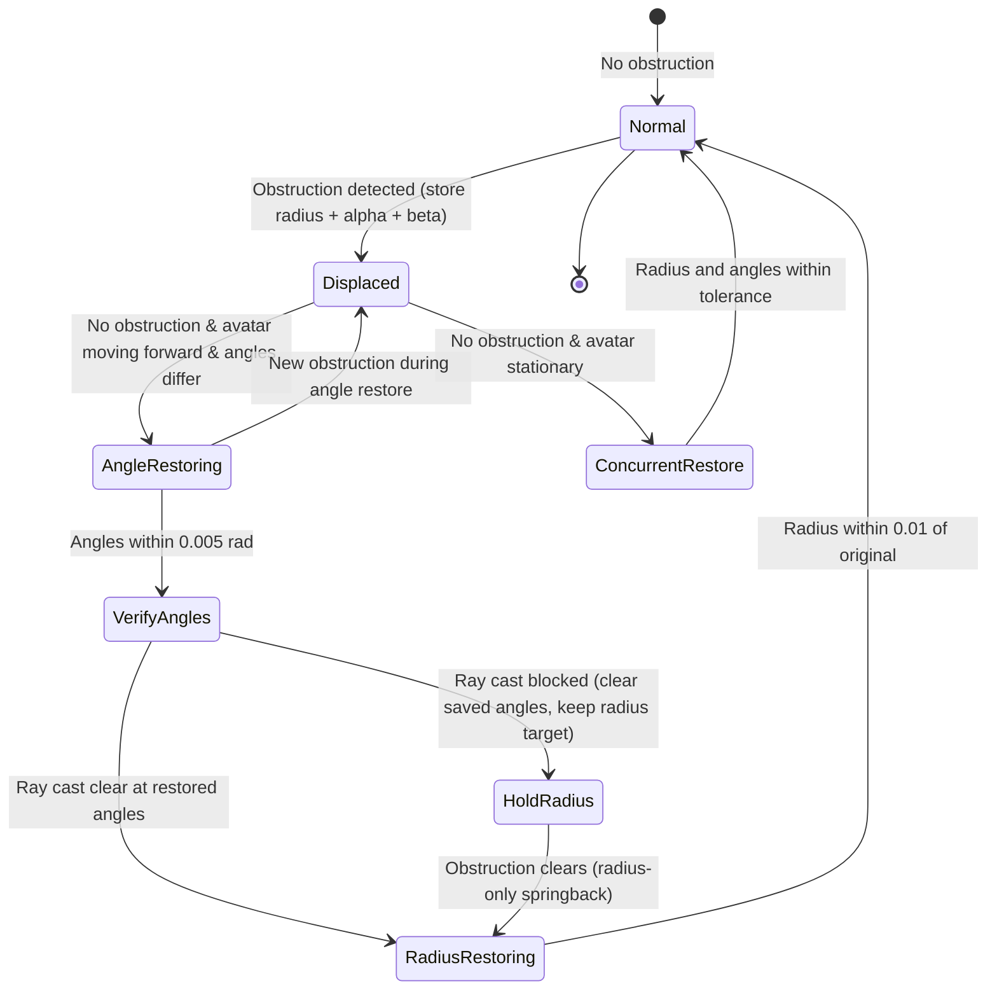

# Design Document: Springback Alpha/Beta Restoration

## Overview

This feature extends the existing elastic camera springback system to restore the ArcRotateCamera's alpha (horizontal angle) and beta (vertical angle) after an obstruction clears. Currently, when an obstruction pushes the camera inward, only the radius is stored and recovered. This enhancement adds angle tracking and restoration using the same step-based deceleration formula (`remaining / steps`), with a priority system that restores angles before radius during avatar forward movement.

The design integrates into the existing `_handleObstruction()` method and `_updateTargetValue()` flow within `CharacterController`, adding new private state fields and extending the springback logic path. Angle restoration is independently toggleable and persisted via `CCSettings`.

## Architecture

The feature extends the existing springback architecture without introducing new classes or modules. All logic lives within `CharacterController` in `src/CharacterController.ts`, consistent with the single-file architecture.



### Key Design Decisions

1. **Concurrent vs. Sequential Restoration**: When the avatar is stationary and no obstruction exists, angles and radius restore concurrently (Requirement 2.4). When the avatar moves forward, angles restore first, then radius after verification (Requirement 3).

2. **Same Formula**: Angle restoration uses the identical `remaining / _springbackSteps` deceleration formula as radius springback, sharing the `_springbackSteps` configuration (Requirement 2.2).

3. **User Change Detection**: Angle changes are detected by comparing the actual per-frame delta against the expected step size, with a minimum threshold of 0.001 radians to avoid floating-point false positives (Requirement 6.3).

4. **Independent Toggle**: `_springbackAngleRestore` defaults to `true` and can be toggled independently. Angle restoration requires `_springback` (radius springback) to also be enabled (Requirement 7.6).

## Components and Interfaces

### New Public API

```typescript
// Enable/disable angle restoration independently
public setSpringbackAngleRestore(b: boolean): void;
public isSpringbackAngleRestore(): boolean;
```

### Modified Public API

```typescript
// getSettings() — adds springbackAngleRestore to returned CCSettings
public getSettings(): CCSettings;

// setSettings() — reads springbackAngleRestore if present
public setSettings(ccs: CCSettings): void;
```

### Internal Methods (modified)

| Method | Modification |
|--------|-------------|
| `_handleObstruction()` | Store `_originalAlpha`/`_originalBeta` on first push-in; add angle restoration logic in the no-obstruction branch; add user angle change detection; handle interruption by new obstructions during angle restore |
| `_updateTargetValue()` | Add angle-priority logic during avatar forward movement (holdCameraPos branch); suppress radius restoration while angles are restoring |

### Internal State (new private fields)

```typescript
private _originalAlpha: number | null = null;
private _originalBeta: number | null = null;
private _springbackAngleRestore: boolean = true;
private _expectedAlpha: number | null = null;
private _expectedBeta: number | null = null;
private _angleRestorationActive: boolean = false;
```

## Data Models

### Extended CCSettings

```typescript
export class CCSettings {
    // ... existing fields ...
    public springbackAngleRestore?: boolean;
}
```

### State Tracking

| Field | Type | Purpose |
|-------|------|---------|
| `_originalAlpha` | `number \| null` | Pre-obstruction alpha; null when no angle recovery is pending |
| `_originalBeta` | `number \| null` | Pre-obstruction beta; null when no angle recovery is pending |
| `_expectedAlpha` | `number \| null` | Expected alpha for next frame (for user-change detection) |
| `_expectedBeta` | `number \| null` | Expected beta for next frame (for user-change detection) |
| `_springbackAngleRestore` | `boolean` | Whether angle restoration is enabled (default: true) |
| `_angleRestorationActive` | `boolean` | Whether angle restoration is currently in progress (used for priority logic) |

### Angle Restoration Step Formula

The same deceleration formula used for radius:

```
alphaStep = (originalAlpha - currentAlpha) / springbackSteps
betaStep  = (originalBeta  - currentBeta)  / springbackSteps
```

### Snap Threshold

Angles snap to target when both:
- `|originalAlpha - currentAlpha| <= 0.005` radians
- `|originalBeta - currentBeta| <= 0.005` radians

### User Change Detection Threshold

```
expectedAlphaStep = |originalAlpha - currentAlpha| / springbackSteps
threshold = max(expectedAlphaStep, 0.001)
```

A change is user-initiated if the actual delta exceeds this threshold and no obstruction-driven angle change is in progress.

## Correctness Properties

*A property is a characteristic or behavior that should hold true across all valid executions of a system — essentially, a formal statement about what the system should do. Properties serve as the bridge between human-readable specifications and machine-verifiable correctness guarantees.*

### Property 1: Angle storage on first obstruction

*For any* camera state (alpha, beta, radius) where no original angles are stored, when an obstruction first pushes the camera inward and angle restoration is enabled, the stored originalAlpha SHALL equal the pre-push alpha and the stored originalBeta SHALL equal the pre-push beta.

**Validates: Requirements 1.1, 7.3**

### Property 2: Stored angles immutable across subsequent obstructions

*For any* stored originalAlpha and originalBeta values, and *for any* sequence of subsequent obstruction-driven radius reductions, the stored originalAlpha and originalBeta SHALL remain equal to their initially stored values.

**Validates: Requirements 1.2, 5.2, 5.4**

### Property 3: Coordinated clearing of angle state with radius state

*For any* event that causes originalRadius to be set to null (radius recovery complete, avatar movement restoring distance, or user scroll reducing radius), the originalAlpha and originalBeta SHALL also be set to null in the same operation.

**Validates: Requirements 1.3, 1.5**

### Property 4: User angle change updates stored targets

*For any* camera state where originalAlpha is not null, if the camera alpha or beta changes by more than the user-change detection threshold in a single frame and no system-driven angle change is in progress, the stored originalAlpha SHALL be updated to the current camera alpha and originalBeta SHALL be updated to the current camera beta.

**Validates: Requirements 1.4, 6.2**

### Property 5: Angle step formula produces decelerating motion

*For any* remaining angular distance D > 0.005 radians and springback steps S in [1, 1000], the per-frame angle step SHALL equal D / S, and after applying the step the new remaining distance SHALL be D * (S-1) / S, which is strictly less than D.

**Validates: Requirements 2.2, 5.3**

### Property 6: Angle snap at threshold

*For any* originalAlpha and originalBeta, when the current camera alpha is within 0.005 radians of originalAlpha AND the current camera beta is within 0.005 radians of originalBeta, the camera alpha SHALL be set exactly to originalAlpha and the camera beta SHALL be set exactly to originalBeta.

**Validates: Requirements 2.3**

### Property 7: Concurrent angle and radius restoration

*For any* camera state where both originalRadius and originalAlpha are not null, no obstruction is detected, and the avatar is not moving forward, both the radius step and the angle steps SHALL be applied in the same frame, each moving their respective values toward their targets.

**Validates: Requirements 2.4**

### Property 8: Angle-priority suppresses radius during forward movement

*For any* camera state where originalAlpha is not null and the avatar is moving forward while the camera is displaced, the angle restoration steps SHALL be applied but the radius SHALL remain unchanged until angle restoration completes (both angles within 0.005 radians of targets).

**Validates: Requirements 3.1, 3.2**

### Property 9: Obstruction evaluation at restored angles

*For any* pick distance P, ellipsoid radius E, and current camera-to-target distance C, if (P - E) > C then the obstruction blocks radius restoration at the restored angles, and the system SHALL clear originalAlpha/originalBeta to null while retaining originalRadius.

**Validates: Requirements 4.3**

### Property 10: Disabled angle restore preserves angles during springback

*For any* camera state where angle restoration is disabled (`_springbackAngleRestore = false`) and radius springback is active, the camera alpha and beta SHALL not be modified by the springback system, while the radius SHALL move toward originalRadius.

**Validates: Requirements 7.4**

### Property 11: Angle restoration requires springback enabled

*For any* camera state where radius springback is disabled (`_springback = false`), angle restoration SHALL not occur regardless of the `_springbackAngleRestore` setting.

**Validates: Requirements 7.6**

### Property 12: User change detection threshold formula

*For any* remaining angular distance D and springback steps S in [1, 1000], the user-change detection threshold SHALL equal max(D / S, 0.001) radians, ensuring the threshold is never below 0.001 to avoid floating-point false positives.

**Validates: Requirements 6.3**

### Property 13: User change detection OR logic

*For any* alpha delta and beta delta, the change SHALL be classified as user-initiated if either |alphaDelta| > threshold OR |betaDelta| > threshold, where threshold is computed independently for each axis.

**Validates: Requirements 6.1, 6.5**

### Property 14: Settings round-trip preserves angle restore configuration

*For any* boolean value of springbackAngleRestore, saving settings via getSettings() and then restoring via setSettings() onto a controller with a different angle restoration state SHALL produce an `isSpringbackAngleRestore()` return value identical to the value at the time of saving. If the settings object does not contain the property, the current state SHALL remain unchanged.

**Validates: Requirements 8.3, 8.5**

## Error Handling

| Scenario | Handling |
|----------|----------|
| `_springbackAngleRestore` set during active recovery | Applied immediately — if disabled, angle steps stop; if enabled, they resume toward stored targets |
| `originalAlpha`/`originalBeta` are null when angle restoration is attempted | No-op; angle restoration only runs when both are non-null |
| Ray cast returns empty results at restored angles | Treated as "no obstruction" — proceed with radius restoration |
| Floating-point drift in angle comparison | Snap threshold (0.005 rad) and user-change minimum threshold (0.001 rad) provide sufficient margin |
| `_springbackSteps` is 1 | Full remaining distance applied in one step (valid behavior, same as radius) |
| Camera alpha wraps around (e.g., crosses 0/2π boundary) | Use direct subtraction since ArcRotateCamera alpha is not clamped to [0, 2π] — BabylonJS handles the wrapping internally |
| `setSpringbackAngleRestore` called with non-boolean | TypeScript type system prevents this at compile time |

## Testing Strategy

### Property-Based Tests (fast-check, minimum 100 iterations each)

The following property-based tests validate the correctness properties defined above. Each test extracts pure logic into standalone functions (no BabylonJS scene instantiation needed), consistent with the existing test patterns in this project.

**Library**: fast-check (already in devDependencies)
**Runner**: vitest (already configured)
**Minimum iterations**: 100 per property

| Test File | Properties Covered |
|-----------|-------------------|
| `tests/springback-angle-storage.test.ts` | Properties 1, 2, 3 |
| `tests/springback-angle-step-formula.test.ts` | Properties 5, 6 |
| `tests/springback-angle-restoration.test.ts` | Properties 7, 8 |
| `tests/springback-angle-obstruction-eval.test.ts` | Property 9 |
| `tests/springback-angle-user-detection.test.ts` | Properties 4, 12, 13 |
| `tests/springback-angle-enable-disable.test.ts` | Properties 10, 11 |
| `tests/springback-angle-settings.test.ts` | Property 14 |

Each test file tags its tests with:
```
Feature: springback-alpha-beta-restoration, Property {N}: {title}
```

### Unit Tests (example-based)

| Scenario | Validates |
|----------|-----------|
| Ray cast clear at restored angles → radius restoration proceeds | Requirements 3.4, 4.4 |
| Ray cast blocked at restored angles → angles cleared, radius retained | Requirements 3.5, 4.3 |
| New obstruction during angle restoration → push-in applied, angles retained | Requirements 5.1 |
| Toggle `setSpringbackAngleRestore(false)` during active recovery → angle steps stop immediately | Requirements 7.7 |
| User angle change with `originalAlpha = null` → no state modification | Requirements 6.4 |
| Restore CCSettings without `springbackAngleRestore` → no error, other settings applied | Requirements 8.4 |
| Default value of `_springbackAngleRestore` is `true` | Requirements 7.2 |

### Integration Considerations

The ray cast logic (Requirements 4.1, 4.2) uses BabylonJS `multiPickWithRay` and cannot be unit-tested without a scene. These are verified through manual testing in the `tst/` HTML test pages. The pure decision logic (what to do given ray cast results) is covered by the property and unit tests above.

