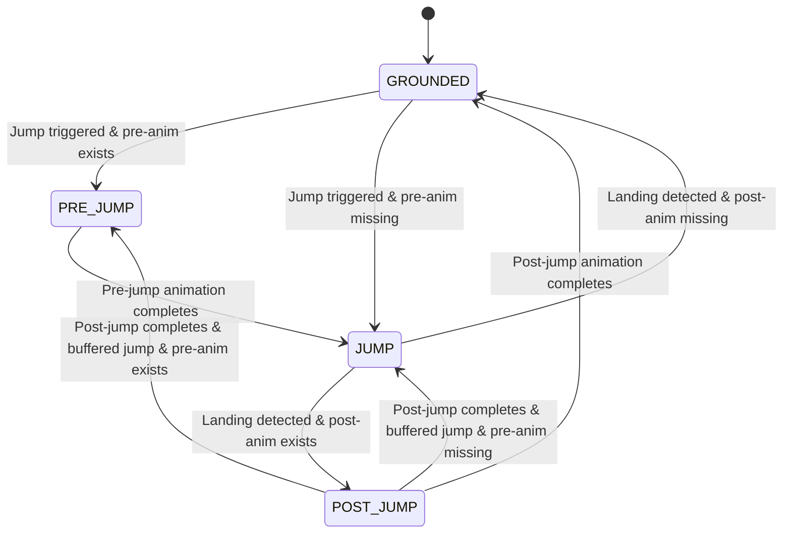
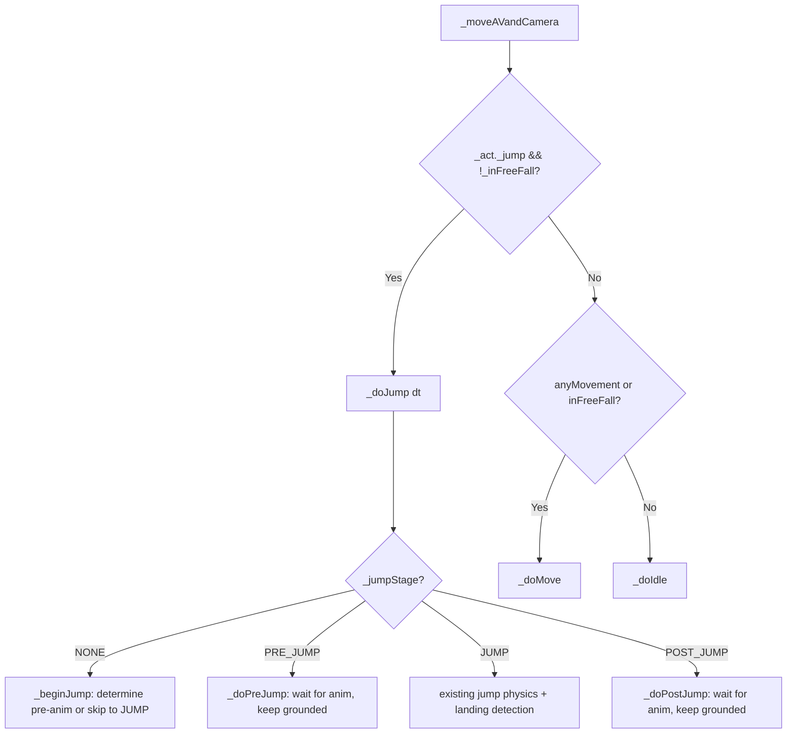
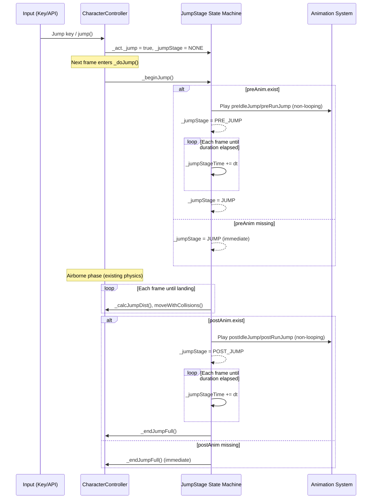

# Design Document: Three-Stage Jump

## Overview

This design introduces a three-stage jump sequence (pre-jump → jump → post-jump) to the CharacterController. The feature is implemented as a state machine layered on top of the existing jump logic. Each stage is gated by the presence of the corresponding animation: if the animation's `exist` flag is `false`, the stage is skipped and the next stage begins immediately. This preserves full backward compatibility — when no pre/post animations are registered, the jump behaves identically to the current single-stage implementation.

The state machine is driven entirely within the existing `_moveAVandCamera()` dispatch loop. A new `_jumpStage` enum variable replaces the simple boolean `_act._jump` as the primary jump progression tracker, though `_act._jump` remains `true` throughout all three stages to maintain the existing dispatch guard (`if (this._act._jump && !this._inFreeFall)`).

## Architecture

### Three-Stage Jump State Machine



### Integration with Existing Dispatch Loop

The current `_moveAVandCamera()` dispatch is:

```
if (_act._jump && !_inFreeFall) → _doJump(dt)
else if (anyMovement() || _inFreeFall) → _doMove(dt)
else → _doIdle(dt)
```

The `_act._jump` flag remains `true` during all three stages (PRE_JUMP, JUMP, POST_JUMP), so the existing dispatch guard continues to route to `_doJump(dt)`. Inside `_doJump`, the new `_jumpStage` enum determines which sub-handler to execute:



## Components and Interfaces

### New Enum: JumpStage

```typescript
const enum JumpStage {
    NONE = 0,
    PRE_JUMP = 1,
    JUMP = 2,
    POST_JUMP = 3
}
```

Using `const enum` ensures zero runtime overhead (inlined as integers by TypeScript).

### New State Variables

| Variable | Type | Purpose |
|----------|------|---------|
| `_jumpStage` | `JumpStage` | Current stage in the three-stage sequence |
| `_jumpStageTime` | `number` | Elapsed time in the current pre/post stage (seconds) |
| `_jumpStageDuration` | `number` | Total duration of the current pre/post animation (seconds) |
| `_jumpBuffered` | `boolean` | Whether a jump request was buffered during POST_JUMP |
| `_wasIdleJump` | `boolean` | Whether the current jump originated from idle (for post-jump animation selection) |

### Modified Existing Methods

#### `_doJump(dt: number): ActionData`

Becomes a dispatcher based on `_jumpStage`:

```typescript
private _doJump(dt: number): ActionData {
    switch (this._jumpStage) {
        case JumpStage.NONE:
            return this._beginJump(dt);
        case JumpStage.PRE_JUMP:
            return this._doPreJump(dt);
        case JumpStage.JUMP:
            return this._doJumpAirborne(dt);
        case JumpStage.POST_JUMP:
            return this._doPostJump(dt);
    }
}
```

#### `_endJump()`

Extended to handle post-jump transition:

```typescript
private _endJump() {
    // Check if post-jump animation should play
    const postAnim = this._wasIdleJump
        ? this._actionMap.postIdleJump
        : this._actionMap.postRunJump;

    if (postAnim.exist) {
        this._jumpStage = JumpStage.POST_JUMP;
        this._jumpStageTime = 0;
        this._jumpStageDuration = this._getAnimDuration(postAnim);
        // _act._jump stays true to keep dispatch routing to _doJump
    } else {
        this._endJumpFull();
    }
}
```

#### New `_endJumpFull()`

The original `_endJump()` cleanup, extracted:

```typescript
private _endJumpFull() {
    this._act._jump = false;
    this._jumpStage = JumpStage.NONE;
    this._jumpStageTime = 0;
    this._jumpStageDuration = 0;
    this._jumpTime = 0;
    this._wasWalking = false;
    this._wasRunning = false;
    this._wasIdleJump = false;
    this._jumpBuffered = false;

    // If a jump was buffered during post-jump, trigger it next frame
    if (this._jumpBuffered) {
        this._jumpBuffered = false;
        this._act._jump = true;
    }
}
```

#### `_onKeyDown(e: KeyboardEvent)`

Modified to respect jump stage:

```typescript
case this._actionMap.idleJump.key:
    if (this._jumpStage === JumpStage.NONE) {
        this._act._jump = true;
    } else if (this._jumpStage === JumpStage.POST_JUMP) {
        this._jumpBuffered = true;
    }
    // PRE_JUMP and JUMP stages: ignore
    break;
```

Movement keys are also gated:

```typescript
// In each movement key case, add guard:
if (this._jumpStage === JumpStage.PRE_JUMP || this._jumpStage === JumpStage.POST_JUMP) break;
```

#### `jump()` (public API)

Modified to check all active states:

```typescript
public jump() {
    if (this._jumpStage !== JumpStage.NONE) return;
    if (this._inFreeFall) return;
    this._act.reset();
    this._act._jump = true;
}
```

### New Methods

#### `_beginJump(dt: number): ActionData`

Determines whether to enter PRE_JUMP or skip directly to JUMP:

```typescript
private _beginJump(dt: number): ActionData {
    // Capture movement state at jump initiation
    this._wasIdleJump = !this._wasWalking && !this._wasRunning;

    const preAnim = this._wasIdleJump
        ? this._actionMap.preIdleJump
        : this._actionMap.preRunJump;

    if (preAnim.exist) {
        this._jumpStage = JumpStage.PRE_JUMP;
        this._jumpStageTime = 0;
        this._jumpStageDuration = this._getAnimDuration(preAnim);
        return preAnim;
    } else {
        // Skip pre-jump, go directly to airborne
        this._jumpStage = JumpStage.JUMP;
        return this._doJumpAirborne(dt);
    }
}
```

#### `_doPreJump(dt: number): ActionData`

Handles the pre-jump grounded stage:

```typescript
private _doPreJump(dt: number): ActionData {
    this._jumpStageTime += dt;

    const preAnim = this._wasIdleJump
        ? this._actionMap.preIdleJump
        : this._actionMap.preRunJump;

    if (this._jumpStageTime >= this._jumpStageDuration) {
        // Pre-jump animation complete, transition to airborne
        this._jumpStage = JumpStage.JUMP;
        this._jumpStageTime = 0;
        return this._doJumpAirborne(dt);
    }

    // Keep avatar grounded — no displacement applied
    return preAnim;
}
```

#### `_doJumpAirborne(dt: number): ActionData`

Contains the existing airborne jump physics (current `_doJump` body), unchanged in logic.

#### `_doPostJump(dt: number): ActionData`

Handles the post-jump grounded stage:

```typescript
private _doPostJump(dt: number): ActionData {
    this._jumpStageTime += dt;

    const postAnim = this._wasIdleJump
        ? this._actionMap.postIdleJump
        : this._actionMap.postRunJump;

    if (this._jumpStageTime >= this._jumpStageDuration) {
        // Post-jump animation complete
        const buffered = this._jumpBuffered;
        this._endJumpFull();
        if (buffered) {
            this._act._jump = true;
        }
        return null; // Let next frame pick up idle/move/jump
    }

    // Keep avatar grounded during post-jump
    return postAnim;
}
```

#### `_getAnimDuration(actData: ActionData): number`

Computes the playback duration of a non-looping animation in seconds:

```typescript
private _getAnimDuration(actData: ActionData): number {
    if (this._isAG) {
        const ag = actData.ag;
        const frameCount = ag.to - ag.from;
        const fps = ag.targetedAnimations[0].animation.framePerSecond;
        return frameCount / (fps * Math.abs(actData.rate));
    } else {
        const range = this._skeleton.getAnimationRange(actData.name);
        const frameCount = range.to - range.from;
        const fps = 30; // BabylonJS default skeleton fps
        return frameCount / (fps * Math.abs(actData.rate));
    }
}
```

### New Animation Registration API

Following the existing `set*Anim` pattern:

```typescript
public setPreIdleJumpAnim(rangeName: string | AnimationGroup, rate: number, loop: boolean) {
    this._setAnim(this._actionMap.preIdleJump, rangeName, rate, loop);
}
public setPostIdleJumpAnim(rangeName: string | AnimationGroup, rate: number, loop: boolean) {
    this._setAnim(this._actionMap.postIdleJump, rangeName, rate, loop);
}
public setPreRunJumpAnim(rangeName: string | AnimationGroup, rate: number, loop: boolean) {
    this._setAnim(this._actionMap.preRunJump, rangeName, rate, loop);
}
public setPostRunJumpAnim(rangeName: string | AnimationGroup, rate: number, loop: boolean) {
    this._setAnim(this._actionMap.postRunJump, rangeName, rate, loop);
}
```

### ActionMap and Actions Additions

```typescript
// In Actions constant:
export const Actions = {
    // ... existing entries ...
    PREIDLEJUMP: "preIdleJump",
    POSTIDLEJUMP: "postIdleJump",
    PRERUNJUMP: "preRunJump",
    POSTRUNJUMP: "postRunJump",
    // ...
} as const

// In ActionMap class:
export class ActionMap {
    // ... existing entries ...
    public preIdleJump = new ActionData(Actions.PREIDLEJUMP, 0, "na");
    public postIdleJump = new ActionData(Actions.POSTIDLEJUMP, 0, "na");
    public preRunJump = new ActionData(Actions.PRERUNJUMP, 0, "na");
    public postRunJump = new ActionData(Actions.POSTRUNJUMP, 0, "na");
    // ...
}
```

The speed for pre/post jump ActionData is `0` since they don't produce displacement. The key is `"na"` (not assigned) since they aren't triggered by a dedicated key.

### Auto-Detection

No changes needed. The existing `_checkAnimRanges(skel)` iterates all keys of `_actionMap` and checks if `skel.getAnimationRange(anim.id)` is non-null. Since the new ActionData entries have `id` values matching the expected range names ("preIdleJump", "postIdleJump", "preRunJump", "postRunJump"), they will be auto-detected automatically.

Similarly, `checkAGs(agMap)` matches by `anim.name`, which is set by `_setAnim` or by the auto-detection itself.

For Requirement 7.3 (preserving manual registration), the existing pattern already handles this: `_setAnim` sets `exist = true` unconditionally and `_checkAnimRanges` also sets `exist = true` if found. Since both result in `exist = true` with the correct animation data, and `_setAnim` stores the user-provided rate/loop, a subsequent `_checkAnimRanges` call would overwrite `name` but not `rate`/`loop`. To fully preserve manual registration, we add a guard:

```typescript
private _checkAnimRanges(skel: Skeleton) {
    let keys: string[] = Object.keys(this._actionMap);
    for (let key of keys) {
        let anim = this._actionMap[key];
        if (!(anim instanceof ActionData)) continue;
        if (anim.exist) continue; // <-- NEW: skip if already registered manually
        if (skel != null) {
            if (skel.getAnimationRange(anim.id) != null) {
                anim.name = anim.id;
                anim.exist = true;
                this._hasAnims = true;
            }
        } else {
            anim.exist = false;
        }
    }
    this._checkFastAnims();
}
```

This guard also protects existing animations — it's safe because if `exist` is already `true`, the animation is already configured.

## Data Models

### State Flow Diagram



### Animation Completion Detection Strategy

Pre-jump and post-jump animations are non-looping by nature. Rather than subscribing to BabylonJS animation events (which would add coupling to the animation system's event model), we use **time-based completion detection**:

1. At stage entry, compute the animation's playback duration: `frameCount / (fps × |rate|)`
2. Each frame, accumulate `dt` into `_jumpStageTime`
3. When `_jumpStageTime >= _jumpStageDuration`, the stage is complete

This approach:
- Works identically for both AnimationRanges and AnimationGroups
- Is deterministic and testable (pure math, no event subscription)
- Avoids issues with animation blending delays or event timing
- Keeps the state machine self-contained within `_doJump`

The `loop` parameter for pre/post animations should be set to `false` when registering them. If a user accidentally sets `loop = true`, the time-based completion still fires and transitions state — the animation system will stop the old animation when `_prevActData` changes in the next frame's animation playback logic.

## Correctness Properties

*A property is a characteristic or behavior that should hold true across all valid executions of a system — essentially, a formal statement about what the system should do. Properties serve as the bridge between human-readable specifications and machine-verifiable correctness guarantees.*

### Property 1: Pre-jump keeps avatar grounded

*For any* jump trigger (idle or moving) where the corresponding pre-jump animation exists, the avatar's Y position SHALL NOT change during any frame where `_jumpStage === PRE_JUMP`.

**Validates: Requirements 1.1, 1.2**

### Property 2: Pre-jump completion transitions to jump stage

*For any* pre-jump stage where `_jumpStageTime` has accumulated to at least `_jumpStageDuration`, the next call to `_doPreJump(dt)` SHALL set `_jumpStage` to `JUMP`.

**Validates: Requirements 1.3**

### Property 3: Pre-jump skip when animation missing

*For any* jump trigger where the corresponding pre-jump animation's `exist` flag is `false`, `_beginJump(dt)` SHALL set `_jumpStage` directly to `JUMP` and produce non-zero vertical displacement on the same frame.

**Validates: Requirements 2.1, 2.2**

### Property 4: Backward compatibility with no pre/post animations

*For any* jump scenario where all four pre/post ActionData entries have `exist === false`, the three-stage jump system SHALL produce the same displacement vector and state transitions as the original single-stage `_doJump` implementation for the same input parameters (gravity, speed, dt, wasWalking, wasRunning, jumpTime).

**Validates: Requirements 2.3**

### Property 5: Jump displacement formula correctness

*For any* valid jumpSpeed > 0, gravity > 0, jumpTime ≥ 0, and dt > 0, `_calcJumpDist(speed, dt)` SHALL return a value equal to `(speed - gravity × jumpTime) × dt - 0.5 × gravity × dt²` within floating-point precision.

**Validates: Requirements 3.4**

### Property 6: Jump stage uses correct speed components

*For any* jump in the JUMP stage: if `_wasIdleJump` is true, the horizontal displacement SHALL be zero and vertical displacement SHALL use `idleJump.speed`; if `_wasWalking` is true, horizontal displacement SHALL use `walk.speed`; if `_wasRunning` is true, horizontal displacement SHALL use `run.speed`; and in both walking/running cases, vertical displacement SHALL use `runJump.speed`.

**Validates: Requirements 3.1, 3.2, 3.3**

### Property 7: Landing detection ends jump stage

*For any* frame during `_jumpStage === JUMP` where `_calcJumpDist` returns a negative value AND the avatar's Y position is at or above the jump start position, the jump stage SHALL end (transitioning to POST_JUMP or GROUNDED depending on post-jump animation existence).

**Validates: Requirements 3.5**

### Property 8: Post-jump stage entered when animation exists

*For any* landing event where the corresponding post-jump animation's `exist` flag is `true`, `_jumpStage` SHALL transition to `POST_JUMP` and `_act._jump` SHALL remain `true`.

**Validates: Requirements 4.1, 4.2**

### Property 9: Post-jump skip and cleanup when animation missing

*For any* landing event where the corresponding post-jump animation's `exist` flag is `false`, `_endJumpFull()` SHALL be called on the same frame, resulting in `_act._jump === false`, `_jumpStage === NONE`, `_jumpTime === 0`, `_wasWalking === false`, and `_wasRunning === false`.

**Validates: Requirements 4.5, 5.1, 5.2, 5.3**

### Property 10: Jump inputs ignored during pre-jump and airborne stages

*For any* state where `_jumpStage` is `PRE_JUMP` or `JUMP`, processing a jump key press SHALL NOT modify `_jumpStage`, `_jumpTime`, or `_jumpStageTime`.

**Validates: Requirements 1.4, 8.1, 8.2**

### Property 11: Movement inputs ignored during pre-jump and post-jump stages

*For any* state where `_jumpStage` is `PRE_JUMP` or `POST_JUMP`, processing movement key presses (walk, walkback, strafe, turn) SHALL NOT modify `_act._walk`, `_act._walkback`, `_act._stepLeft`, `_act._stepRight`, `_act._turnLeft`, or `_act._turnRight`.

**Validates: Requirements 8.3, 8.5**

### Property 12: Jump buffering during post-jump

*For any* state where `_jumpStage` is `POST_JUMP`, processing N ≥ 1 jump key presses SHALL result in `_jumpBuffered === true` (a single buffered request regardless of N). When the post-jump stage completes with `_jumpBuffered === true`, a new jump SHALL be initiated on the next frame.

**Validates: Requirements 8.4**

### Property 13: Post-jump completion restores normal processing

*For any* state where `_jumpStage === POST_JUMP` and `_jumpStageTime >= _jumpStageDuration`, the next `_doPostJump(dt)` call SHALL result in `_act._jump === false` and `_jumpStage === NONE`, allowing the main dispatch loop to route to `_doIdle` or `_doMove` based on current input.

**Validates: Requirements 4.3, 4.4**

### Property 14: Programmatic jump() triggers same state machine

*For any* grounded state with no active jump (`_jumpStage === NONE` and `_inFreeFall === false`), calling `jump()` SHALL result in the same state transitions as processing a jump key press — either entering PRE_JUMP (if pre-animation exists) or JUMP (if not).

**Validates: Requirements 9.1**

### Property 15: jump() ignored during active jump or free-fall

*For any* state where `_jumpStage !== NONE` OR `_inFreeFall === true`, calling `jump()` SHALL NOT modify any state variables (`_act._jump`, `_jumpStage`, `_jumpTime`, `_jumpStageTime`).

**Validates: Requirements 9.2, 9.3**

## Error Handling

| Scenario | Handling |
|----------|----------|
| Pre/post animation `exist` is `false` | Stage is skipped entirely — no error, no delay |
| Animation duration computes to 0 or negative (bad range data) | Treat as immediate completion — transition to next stage on same frame |
| `_getAnimDuration` called on ActionData with null `ag` or missing skeleton range | Return 0, causing immediate stage transition (graceful degradation) |
| `jump()` called during active jump | Silently ignored (no error thrown) |
| `jump()` called during free-fall | Silently ignored |
| Jump key pressed during PRE_JUMP or JUMP | Silently ignored |
| Jump key pressed during POST_JUMP | Buffered (at most one) |
| Movement keys during PRE_JUMP or POST_JUMP | Silently ignored (key state not modified) |
| User sets `loop = true` on pre/post animation | Time-based completion still fires; animation stops when next actData change occurs |

## Testing Strategy

### Property-Based Tests (fast-check + vitest)

Property-based testing is appropriate here because:
- The jump state machine is pure logic with clear input/output behavior
- State transitions follow universal rules that hold for all valid inputs
- The input space (speeds, gravity, dt, animation durations) is continuous and infinite
- The displacement formula is a pure function with no side effects

**Library**: fast-check (already in the project)
**Configuration**: Minimum 100 iterations per property
**Tag format**: `Feature: three-stage-jump, Property N: <property text>`

Each correctness property (1–15) maps to a single property-based test. Tests will extract the state machine logic into pure functions that can be tested without BabylonJS scene instantiation, following the project's existing test pattern.

#### Testable Pure Functions to Extract

1. **`calcJumpDist(speed, gravity, jumpTime, dt)`** — already exists, pure math
2. **`beginJump(wasWalking, wasRunning, preIdleExists, preRunExists)`** → returns next JumpStage
3. **`doPreJump(jumpStageTime, dt, jumpStageDuration)`** → returns `{ nextStage, newStageTime }`
4. **`doPostJump(jumpStageTime, dt, jumpStageDuration, jumpBuffered)`** → returns `{ nextStage, newStageTime, triggerNewJump }`
5. **`computeJumpDisplacement(wasIdleJump, wasWalking, wasRunning, walkSpeed, runSpeed, idleJumpSpeed, runJumpSpeed, gravity, jumpTime, dt, moveDirection)`** → returns displacement Vector3
6. **`shouldEndJump(jumpDist, avatarY, jumpStartY, avStartPosY)`** → returns boolean
7. **`handleJumpInput(currentStage)`** → returns `{ accepted, buffered }`
8. **`handleMovementInput(currentStage)`** → returns boolean (whether to accept)
9. **`getAnimDuration(frameCount, fps, rate)`** — pure math

### Unit Tests (example-based)

- API existence: verify `setPreIdleJumpAnim`, `setPostIdleJumpAnim`, `setPreRunJumpAnim`, `setPostRunJumpAnim` exist
- ActionMap contains the four new ActionData entries with correct IDs
- Actions constant includes PREIDLEJUMP, POSTIDLEJUMP, PRERUNJUMP, POSTRUNJUMP
- Auto-detection integration: mock skeleton with named ranges, verify `exist` set to `true`
- Manual registration preservation: set animation manually, run auto-detection, verify unchanged

### Integration Tests (manual, via `tst/` pages)

- Avatar with pre/post animations: verify visual sequence plays correctly
- Avatar without pre/post animations: verify behavior unchanged from current
- Keyboard mashing during pre-jump: verify no interruption
- Jump buffering during post-jump: verify one jump fires after landing
- Programmatic `jump()` call: verify same three-stage sequence
