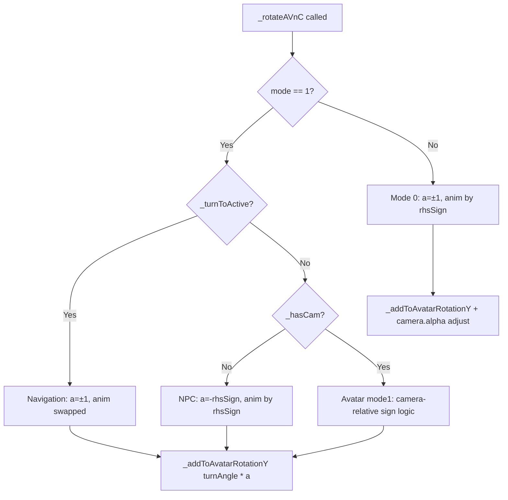

# Design Document: Turn Direction & Animation Fix

## Overview

This bugfix addresses incorrect turn animation selection and rotation direction in the `_rotateAVnC()` method of `CharacterController`. The method has four distinct turn-handling branches, three of which had bugs related to animation/direction mapping:

1. **Navigation mode (turnTo)** — Animation was not swapped to match visual direction
2. **NPC mode (no camera)** — Turn direction was camera-dependent and animation was reversed in RHS
3. **Mode 0 avatar in RHS** — Animation did not account for reversed visual direction in right-handed scenes

## Root Cause Analysis

### Bug Condition C(X)

The `_rotateAVnC()` method selects a rotation sign `a` (applied to `rotation.y`) and an animation (`turnLeft` or `turnRight` ActionData). The bug condition is:

**C(X): The visual rotation direction produced by sign `a` does not match the animation being played.**

This manifests differently in each branch:

| Branch | Symptom | Root Cause |
|--------|---------|------------|
| Navigation mode | turnLeft command visually turns right but plays turnLeft anim | Animation mapped to command name, not visual direction |
| NPC (no camera) | Turn direction depended on camera position; animation reversed in RHS | Used camera-relative `_isAvFacingCamera()` and `_ffSign` for a camera-less character |
| Mode 0 avatar in RHS | Correct rotation but wrong animation | Animation hardcoded without considering `_rhsSign` |

### Why the original code was wrong

The original mode 1 code computed `_sign = -_ffSign * _isAvFacingCamera()` for ALL mode 1 characters. For NPCs, `_isAvFacingCamera()` returns a fixed `-1` (no camera), making the sign depend on `_ffSign`. But "turn left" is always the same rotational direction regardless of face-forward — `_ffSign` only affects forward/backward movement direction, not left/right rotation.

In mode 0, the camera alpha uses `_rhsSign` to flip in RHS, but the animation selection was hardcoded (`turnLeft` for `_act._turnLeft`), ignoring that the visual direction reverses in RHS.

## Architecture

The fix modifies a single method (`_rotateAVnC`) by restructuring its mode 1 branch into three clearly separated paths and adjusting mode 0's animation selection.

### Modified Method: `_rotateAVnC()`

```
_rotateAVnC(anim, moving, dt):
  if mode == 1:
    if _turnToActive:
      → Navigation branch (turnTo API)
    else if !_hasCam:
      → NPC branch (no camera)
    else:
      → Mode 1 avatar branch (with camera, existing logic)
  else (mode == 0):
    → Mode 0 avatar branch (with RHS animation fix)
```

## Fix Details

### 1. Navigation Mode (mode 1, `_turnToActive`)

The `_updateTurnTo()` method maps positive shortest-arc delta to `turnLeft(true)` and negative to `turnRight(true)`. In `_rotateAVnC`, `turnLeft` → `a = 1` (increases rotation.y). In BabylonJS LHS, increasing rotation.y visually rotates the character to the right. Therefore the animation must be swapped:

```typescript
a = this._act._turnLeft ? 1 : -1;
anim = this._act._turnLeft ? this._actionMap.turnRight : this._actionMap.turnLeft;
```

### 2. NPC Mode (mode 1, `!_hasCam`)

For NPCs, "turn left" is always the same rotational direction regardless of face-forward setting or camera. The only variable is the coordinate system handedness:

```typescript
a = -this._rhsSign;                    // -1 in LHS, +1 in RHS
if (this._act._turnRight) a = -a;      // negate for turnRight
// Animation flips in RHS to match visual direction:
if (this._rhsSign > 0) {
    anim = this._act._turnLeft ? turnLeft : turnRight;
} else {
    anim = this._act._turnLeft ? turnRight : turnLeft;
}
```

**Key insight**: `_ffSign` and `_isLHS_RHS` are NOT used. Face-forward only affects forward/backward movement, not left/right rotation.

### 3. Mode 0 Avatar (RHS animation fix)

In mode 0, `a = 1` for turnLeft always. The camera alpha adjustment uses `_rhsSign`, which reverses the visual direction in RHS. The animation must match the visual direction:

```typescript
if (this._act._turnLeft) {
    anim = (this._rhsSign > 0) ? turnLeft : turnRight;
} else {
    anim = (this._rhsSign > 0) ? turnRight : turnLeft;
}
```

## Data Flow



## Correctness Properties

### Property 1: NPC turn direction is camera-independent

*For any* NPC character (no camera), calling `turnLeft(true)` SHALL always produce the same rotation direction regardless of any external camera state, face-forward setting, or `_isLHS_RHS` flag. Only `_rhsSign` (coordinate system handedness) affects the rotation sign.

### Property 2: NPC turnLeft and turnRight produce opposite rotations

*For any* NPC character, `turnLeft` and `turnRight` SHALL always produce rotation signs of equal magnitude but opposite direction.

### Property 3: Animation matches visual direction in all coordinate systems

*For any* turn command in any mode (0, 1-NPC, 1-avatar, navigation), the animation played SHALL match the visual rotation direction as perceived by the user, accounting for coordinate system handedness (`_rhsSign`).

### Property 4: Mode 0 rotation sign is constant

*For any* mode 0 avatar, `turnLeft` SHALL always produce `a = 1` and `turnRight` SHALL always produce `a = -1`, regardless of `_rhsSign`. Only the animation and camera alpha adjustment change with handedness.

### Property 5: Navigation mode rotation mapping is fixed

*For any* active `turnTo` operation, `turnLeft` command SHALL always produce `a = 1` (increase rotation.y) and `turnRight` SHALL always produce `a = -1` (decrease rotation.y).

## Testing Strategy

### Test File: `tests/turn-direction-animation.test.ts`

Pure-logic extraction of all four branches, tested with property-based testing (fast-check) and example-based tests:

| Test Group | Properties Covered | Scenarios |
|------------|-------------------|-----------|
| NPC turn (no camera) | P1, P2, P3 | LHS/RHS × turnLeft/turnRight, face-forward independence |
| Mode 0 avatar turn | P3, P4 | LHS/RHS × turnLeft/turnRight |
| Navigation mode (turnTo) | P3, P5 | turnLeft/turnRight mapping |
| Mode 1 avatar turn (with camera) | P3 | front-facing/back-facing × facing-camera/facing-away × isLHS_RHS |

### Extracted Pure Functions

```typescript
// NPC: rotation sign and animation
function npcTurnLogic(turnLeft: boolean, rhsSign: number): { a: number; anim: string }

// Mode 0: rotation sign and animation
function mode0TurnLogic(turnLeft: boolean, rhsSign: number): { a: number; anim: string }

// Navigation: rotation sign and animation
function navigationTurnLogic(turnLeft: boolean): { a: number; anim: string }

// Mode 1 avatar sign computation
function computeMode1Sign(ffSign: number, isAvFacingCamera: number, isLHS_RHS: boolean): number

// Mode 1 avatar: rotation sign and animation from precomputed sign
function mode1AvatarTurnLogic(turnLeft: boolean, sign: number): { a: number; anim: string }
```

## Files Modified

| File | Change |
|------|--------|
| `src/CharacterController.ts` | Modified `_rotateAVnC()`: added NPC branch, swapped navigation animation, added RHS animation logic to mode 0 |
| `tests/turn-direction-animation.test.ts` | New test file with 35 tests covering all branches |
