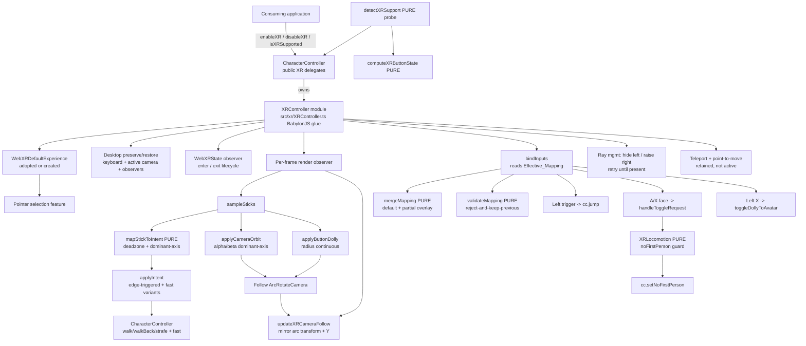

# Design Document: WebXR Support

## Overview

This feature adds immersive VR/AR support directly to the `CharacterController` library. Today the controller drives an avatar on the desktop through an `ArcRotateCamera` plus keyboard or programmatic commands. This design absorbs a set of WebXR avatar, locomotion, and camera behaviors — proven in a consuming application (Vishva) — into the library itself, so that consuming applications can delete their own XR glue and rely on the controller.

The design keeps two decisions at its center, matching the approved requirements:

- **Pass-or-create XR camera** (R1). A developer enables XR either by passing an existing WebXR experience or WebXR camera (which the controller adopts), or by passing nothing (in which case the controller lazily creates its own default XR experience). Enablement is asynchronous and reports success/failure through a resolved boolean rather than throwing.
- **Mirror the follow camera** (R11). The controller keeps driving its existing follow `ArcRotateCamera` exactly as on the desktop. Each frame during a session it mirrors that transform onto the `WebXRCamera` via `setTransformationFromNonVRCamera(arcCamera, true)`, then re-applies the arc camera's Y (the mirror forces the XR camera `position.y` to zero). This carries the third-person follow into the headset without reimplementing follow math.

Locomotion inside a session is **thumbstick-primary** (R6–R10): the left stick moves the avatar (walk / walk-back / strafe) through the existing movement methods with deadzone and dominant-axis gating; clicking the left stick engages the fast/run variant; the left trigger jumps; the right stick orbits the follow camera and the right B/A buttons dolly it — camera controls never rotate the avatar. Teleport and point-to-move remain available but are not the active path (R14).

Which input drives which action is not hardcoded: session-start binding reads an **Effective_Mapping** built by overlaying an optional developer-supplied partial mapping onto a **Default_Mapping** (R18). The pure validation/merge logic is separated so it is testable without a scene.

### Architectural fit with the library

The library has historically used a single-file architecture (`src/CharacterController.ts`, exporting `CharacterController`, `ActionData`, `ActionMap`, `CCSettings`; internal `_Action` is underscore-prefixed and mangled in UMD production). **For this feature that convention is deliberately relaxed** (see D1 / D14): the new WebXR code is placed in its own cohesive modules under `src/xr/` rather than being folded into `CharacterController.ts`. The existing classes (`CharacterController`, `_Action`, `ActionData`, `ActionMap`, `CCSettings`) and the existing pure navigation helpers stay in `src/CharacterController.ts` unchanged — a broader full-library modularization is out of scope for this spec.

Recommended file layout:

- `src/xr/XRController.ts` — the **BabylonJS-facing glue class** (`XRController`, previously conceived as an in-file `_XRController`). Session lifecycle, per-frame stick sampling, camera orbit/dolly/follow, data-driven controller binding, ray management, teleport/point-to-move retention, desktop preserve/restore. Now a normally-named exported-internal class in its own file — it no longer needs a leading underscore for file scoping — though its private **members** still use the `_` prefix mangling convention.
- `src/xr/XRLocomotion.ts` — **pure** locomotion state machine (`XRLocomotion`), `mapStickToIntent`, `neutralMoveIntent`, and the associated types (`StickInput`, `MoveIntent`, `LocomotionMode`, `ToggleResult`, `DEFAULT_STICK_DEADZONE`).
- `src/xr/XRSupport.ts` — **pure** `detectXRSupport`, `computeXRSupportResult`, and `XRSupportState`.
- `src/xr/XRInputMapping.ts` — the `BindableAction` / `BindableInput` enums, `XRInputMapping`, `MappingResult`, `DEFAULT_XR_INPUT_MAPPING`, `mergeXRInputMapping`, `validateXRInputMapping`, the axis/button type partitions, and the standard WebXR component-id constants.

`CharacterController` (in `src/CharacterController.ts`) imports `XRController`, owns one lazily-constructed instance, and exposes a small set of thin public XR methods that delegate to it. It also **re-exports** the public XR types/enums/functions from the XR modules so consumers continue to import them from the library entry point (and they stay in the shared `dist/CharacterController.d.ts`).

Splitting the two kinds of code cleanly:

- **BabylonJS-touching glue** lives in `src/xr/XRController.ts` and is owned by the `CharacterController` instance.
- **Pure logic** (stick→intent mapping, the locomotion sub-mode state machine, capability→result mapping, and the input-mapping validation/merge) lives in `src/xr/XRLocomotion.ts`, `src/xr/XRSupport.ts`, and `src/xr/XRInputMapping.ts`. These carry the machine-verifiable properties and are unit/property tested with no BabylonJS scene. Living in their own files matches the library's pure-logic testing pattern even more directly than the old top-of-file helpers did — the property tests import them directly.

This mirrors Vishva's `XRManager` (stateful glue) / `XRLocomotion` + `XRSupport` (pure) split — and, in spirit, Vishva's `src/managers/` layout — now realized as real module boundaries rather than being folded into a single build file.

## Design Decisions

**D1 — `XRController` glue class in its own module rather than inlining into `CharacterController`.** The XR glue is sizable (lifecycle, per-frame sampling, camera math, controller/ray management, preserve/restore). Isolating it in its own class keeps `CharacterController`'s existing methods readable and keeps the XR state cohesive. Rather than an in-file underscore-prefixed helper (as it would have been under the old single-file convention), it now lives in `src/xr/XRController.ts` as a normally-named exported-internal class. `CharacterController` owns one lazily-constructed `XRController` and exposes thin public delegates. Rationale: cohesion via a real module boundary + minimal churn to the existing class. See D14 for why the single-file convention is relaxed here.

**D2 — Pure logic split out for testability.** The capability→button/result mapping (`src/xr/XRSupport.ts`), the `XRLocomotion` state machine with `noFirstPerson` guard and the `mapStickToIntent` left-stick mapper (`src/xr/XRLocomotion.ts`), and the input-mapping `validateXRInputMapping` / `mergeXRInputMapping` functions (`src/xr/XRInputMapping.ts`) are BabylonJS-free. They are the only pieces that carry universal properties, so they are unit- and property-testable without a scene or headset. Housing them in their own modules matches the library's established pattern of extracting pure logic into standalone functions and lets tests import them directly.

**D3 — Thumbstick locomotion reuses existing movement methods.** The left stick drives `walk`/`walkBack`/`strafeLeft`/`strafeRight` (and `run`/`walkBackFast`/`strafeLeftFast`/`strafeRightFast`), sampled per frame and **edge-triggered** — a method is called only on the frame a direction's active state changes. Rationale: reuses proven collision/slope/animation behavior (R17) and avoids per-frame redundant calls that would reset action state.

**D4 — Dominant-axis gating.** Real thumbsticks bleed onto the off-axis. The left-stick mapper activates at most one of {forward/back} vs {strafe} per frame (larger raw magnitude wins; ties → forward/back). The right-stick orbit activates at most one of {alpha} vs {beta} per frame (ties → alpha). Rationale: backing up never drifts sideways, and orbiting never changes alpha and beta together (which is nausea-inducing).

**D5 — Mode selects camera coupling, not movement.** With stick locomotion the first/third-person `LocomotionMode` only decides whether the controller lets the camera pull in to the avatar (`setNoFirstPerson(false)`) or holds a third-person offset (`setNoFirstPerson(true)`). The state machine and its `noFirstPerson` guard are unchanged by movement. Rationale: keeps the mode meaning orthogonal to the movement mechanism (R4).

**D6 — Follow camera mirrored onto the XR camera.** Instead of reimplementing follow math, `_updateXRCameraFollow` copies the `ArcRotateCamera` transform onto the rendered `WebXRCamera` each frame, then re-applies the arc camera's Y (the copy forces `position.y = 0`). This copy runs unconditionally every frame (see D12) and produces the live follow target that the entry-blend glide (D10) rides. Rationale: single source of truth for follow behavior (R11).

**D7 — Configurable input mapping drives the binding layer.** Session-start binding is data-driven: for each `Bindable_Action` the binder looks up its bound `Bindable_Input` in the `Effective_Mapping` and wires the corresponding controller component. Unbound actions stay inactive. Rationale: developers can remap without touching library internals (R18); the pure validate/merge logic is isolated for testing.

**D8 — HUD and render-pipeline concerns stay out of library scope.** Vishva's design hosted an in-headset HUD and toggled SSAO2/prepass/depth renderer. Those are application concerns. This library exposes the state and behaviors (support detection, sensitivity setters, lifecycle) an application needs, but ships no HUD and touches no render pipeline. The "entry-drop" settling caveat that Vishva mitigated with a hidden HUD is now handled inside the library by the entry-blend glide (D10), so no HUD-deferral workaround is imposed on the consumer.

**D9 — Never throw across the XR boundary.** Enable/disable, support detection, and per-frame glue are defensively guarded and resolve booleans / no-op rather than throwing, so a missing `navigator.xr`, a failed experience creation, or a mocked test environment cannot crash the controller (R1.3, R1.4, R16.2, R16.3). Every BabylonJS and private-map access in the stateful glue — orbit, dolly, follow, ray management, haptic feedback, and the per-frame sampler — is individually try/catch- or shape-guarded so a single odd camera shape or a mocked feature cannot break the render loop.

**D10 — Entry-blend glide smooths the residual entry-drop in the library.** On XR entry the immediate head pose can read grounded, so the first follow frame would snap the view down (the "entry-drop"). The primary fix is now the initial-pose hook (D15), which seeds the XR camera onto the follow pose before the first render so no floor-eye-level snap occurs to begin with. The entry-blend glide remains as a secondary smoother for any residual settling: rather than pushing a HUD-deferral workaround onto the consumer, `_updateXRCameraFollow` glides the camera from its on-entry pose onto the follow pose over `ENTRY_BLEND_FRAMES` (default 90, ≈1s at 72–90Hz). A per-session `entryBlendOffset` is captured once on the first blend frame as (on-entry XR camera position − live follow target) and is added to the **live** follow target each frame scaled by a smoothstep ease that decays monotonically to zero. Because the offset rides the live target, a moving avatar or a settling controller is tracked without the overshoot a target-relative lerp produced. With D15 in place the captured offset is typically near-zero, so the glide is imperceptible; it still absorbs a settling controller pose and the adopt-path case where a developer supplies their own experience whose seed we do not control. Rationale: D15 removes the root cause; the glide is a belt-and-suspenders smoother.

**D11 — Data-driven binding resolves standard WebXR component ids.** The binding layer maps each `Bindable_Input` to a (handedness, WebXR component id) pair and resolves the live component via `motionController.getComponent(id)`. Only the thumbstick, trigger, and a/b/x/y face buttons are bindable: the platform `menu` button is reserved/unreliable in WebXR (its pressed state is not reliably delivered to the page) and is deliberately excluded. Rationale: keeps binding concrete and portable across controller profiles while avoiding an input that cannot be relied upon.

**D12 — Follow copy is unconditional per frame.** An earlier optimization gated the follow mirror to "only when the `ArcRotateCamera` pose changed." It caused an empty-world dolly bug and never fixed the wobble it targeted — the wobble was actually the CharacterController's own camera-elasticity obstruction response. The follow copy is therefore unconditional every frame, which also makes radius/dolly and orbit changes reflect for free. Rationale: correctness over a false optimization; the true wobble source is documented as a known limitation (camera elasticity obstruction).

**D13 — Thumbstick-primary locomotion is a validated drift from the original plan.** The feature was originally planned teleport/point-to-move-primary. During on-device bring-up it drifted to thumbstick-primary because that felt right in the headset; teleport and point-to-move are retained but inactive (R14). This was a deliberate, validated change, not an accident of implementation.

**D14 — WebXR code lives in its own modules; the single-file convention is relaxed for this feature.** The library's steering describes a single-file architecture where everything lives in `src/CharacterController.ts`. That file had grown unwieldy, and folding a feature of this size (session lifecycle, per-frame sampling, camera math, input binding, ray management, plus four pure logic areas) into it would have made it materially harder to read and test. For this feature the convention is relaxed: the new WebXR code is modularized under `src/xr/` — one BabylonJS-facing glue module (`XRController.ts`) and three pure modules (`XRLocomotion.ts`, `XRSupport.ts`, `XRInputMapping.ts`). The scope of the relaxation is deliberately narrow: **only the new WebXR code moves**. The existing `CharacterController` class, `_Action`, `ActionData`, `ActionMap`, `CCSettings`, and the existing pure navigation helpers stay in `src/CharacterController.ts` untouched. A broader full-library modularization is explicitly out of scope and would be a separate spec. The distribution shape is unaffected (see Distribution / mangling): webpack still bundles everything into the same dual UMD/ESM outputs by following imports from the single entry point, and a single shared `dist/CharacterController.d.ts` is still emitted. Rationale: readability and direct testability of the new code, at zero cost to the published artifact.

**D15 — Seed the XR camera onto the follow pose at session start (initial-pose hook), rather than only correcting it afterward.** `WebXRDefaultExperience` (and the underlying basic experience helper) seed the `WebXRCamera` from the non-VR camera on entry via `setTransformationFromNonVRCamera`, which measures head pose from the reference-space floor and so drops the arc camera's Y — the camera appears at standing eye-level from the floor instead of at the follow pose (observed in Vishva). Rather than reimplement the experience helper to avoid the seed (a moving-target maintenance burden that would also not cover a developer-supplied experience), the controller keeps using `WebXRDefaultExperience` (adopt-or-create, R1) and registers a one-shot hook on `baseExperience.onInitialXRPoseSetObservable` (falling back to the `IN_XR` state transition when that observable is unavailable). On the first pose, before the first render, it computes the live follow target (the same mirror-plus-reapply-Y as `_updateXRCameraFollow`, D6) and sets the XR camera directly onto it, so the eye-level drop never appears. This is a small, version-stable hook that honors both the create-path and the adopt-path; the D10 entry-blend glide is retained as a secondary smoother. All access is guarded (D9) so a missing observable never throws. Rationale: fix the entry-drop at its source with minimal, portable surface instead of maintaining an equivalent of a Babylon class.

## Architecture



### Module boundaries

| Unit | Kind / Home | Responsibility |
|------|-------------|----------------|
| `CharacterController` (existing class) | public — `src/CharacterController.ts` | Owns one `XRController`; exposes the public XR API (`enableXR`, `disableXR`, `enterXR`, `exitXR`, `isInXR`, `isXRSupported`, sensitivity setters, deadzone setter, `setXRInputMapping`, `getDefaultXRInputMapping`, `getEffectiveXRInputMapping`). Re-exports the public XR types/enums/functions. Delegates all BabylonJS work to `XRController`. |
| `XRController` | internal glue — `src/xr/XRController.ts` (normally-named exported class; private members underscore-prefixed + UMD-mangled) | Session lifecycle, per-frame stick sampling + edge-triggered movement/fast, camera orbit/dolly/follow, data-driven controller binding, ray management, teleport/point-to-move retention, desktop preserve/restore, observer/capture teardown. |
| `detectXRSupport` / `computeXRSupportResult` | pure functions — `src/xr/XRSupport.ts` | Async probe of `immersive-vr` / `immersive-ar`; pure map of capabilities → per-mode result. No lifecycle. |
| `XRLocomotion` | pure class — `src/xr/XRLocomotion.ts` | First/third-person sub-mode state machine with `canFirstPerson` guard. |
| `mapStickToIntent` / `neutralMoveIntent` | pure functions — `src/xr/XRLocomotion.ts` | Left-stick axes → `MoveIntent` (deadzone + dominant-axis). |
| `DEFAULT_XR_INPUT_MAPPING`, `mergeXRInputMapping`, `validateXRInputMapping` | pure const + functions — `src/xr/XRInputMapping.ts` | Default bindings, partial overlay, and validation (unknown enum, conflict, axis/button type mismatch); also houses the enums, type partitions, and component-id constants. |

## Components and Interfaces

### Public XR API added to `CharacterController`

```typescript
export type XRSessionType = 'vr' | 'ar';

export class CharacterController {
    // ... existing members ...

    /** Lazily-constructed XR glue (imported from src/xr/XRController.ts). Null until enableXR is first called. */
    private _xr: XRController | null = null;

    /**
     * Enable XR by adopting a provided experience/camera or creating a default one.
     * Asynchronous; resolves true on success, false on failure. Never throws. (R1.1–R1.5)
     * @param xr an existing WebXRDefaultExperience or WebXRCamera, or omitted to create one.
     */
    public async enableXR(xr?: any /* WebXRDefaultExperience | WebXRCamera */): Promise<boolean>;

    /** Disable XR support. Restores ArcRotate_Mode first if a session is active. No-op if not enabled. (R1.6–R1.8) */
    public async disableXR(): Promise<void>;

    /** Enter an immersive session of the given type. No-op if XR support disabled or unsupported. (R2) */
    public async enterXR(type: XRSessionType): Promise<void>;

    /** Exit the active session. Idempotent no-op when no session active. (R2.4, R2.5) */
    public async exitXR(): Promise<void>;

    /** True only while an XR session is active. (R2.3) */
    public isInXR(): boolean;

    /**
     * Query device/browser support independently for VR and AR.
     * Resolves { vrSupported:false, arSupported:false } when navigator.xr is absent
     * or when XR support has not been enabled; never throws. (R16)
     */
    public async isXRSupported(): Promise<XRSupportState>;

    /** Set the left-stick deadzone (default 0.15); values outside [0,1] are clamped. (R6.8) */
    public setXRStickDeadzone(v: number): void;

    /** Orbit/dolly sensitivity setters; clamp to range; ignore non-finite. (R12) */
    public setXROrbitAlphaRate(v: number): void;   // clamp 0..0.02
    public setXROrbitBetaRate(v: number): void;    // clamp 0..0.02
    public setXRDollyRate(v: number): void;         // clamp 0..0.2

    /** Configurable input mapping (R18). */
    public setXRInputMapping(mapping: Partial<XRInputMapping>): MappingResult;
    public getDefaultXRInputMapping(): XRInputMapping;
    public getEffectiveXRInputMapping(): XRInputMapping;
}
```

All public methods no-op or resolve safely when `_xr` is null (XR not enabled), preserving R1.9 / R2.7: with XR unenabled the controller behaves identically to its pre-feature behavior.

### `detectXRSupport` + pure result mapping (R16)

```typescript
export interface XRSupportState { vrSupported: boolean; arSupported: boolean; }

/**
 * Thin async probe. Queries WebXRSessionManager.IsSessionSupportedAsync for
 * 'immersive-vr' and 'immersive-ar' independently, each wrapped so a rejection
 * or absence yields false. Absent navigator.xr short-circuits both to false.
 * Never throws. (R16.1, R16.2, R16.3)
 */
export async function detectXRSupport(): Promise<XRSupportState>;

/**
 * Pure: given a raw pair of per-mode probe outcomes (each true|false|error),
 * produce the XRSupportState treating any error as unsupported. (R16.3)
 */
export function computeXRSupportResult(
    vr: boolean | 'error',
    ar: boolean | 'error'
): XRSupportState;
```

`isXRSupported()` on the controller returns `{ false, false }` when `_xr` is null (R16.4) and otherwise delegates to `detectXRSupport`.

### `XRLocomotion` pure state machine (R3, R4)

```typescript
export type LocomotionMode = 'firstPerson' | 'thirdPerson';
export interface ToggleResult { mode: LocomotionMode; changed: boolean; blocked: boolean; }

export class XRLocomotion {
    constructor(initial?: LocomotionMode);            // default 'thirdPerson'
    getMode(): LocomotionMode;

    /** Set a specific mode under the canFirstPerson guard. */
    setMode(mode: LocomotionMode, canFirstPerson: boolean): ToggleResult;

    /** Flip between the two under the guard. */
    toggle(canFirstPerson: boolean): ToggleResult;
}
```

Semantics (R3.3–R3.6): a transition to `firstPerson` requires `canFirstPerson === true`, else `{ blocked:true, changed:false }` and the mode is unchanged; a transition to `thirdPerson` is always allowed and never blocked; `changed` is true only when the resulting mode differs from the prior mode. Session-start defaults come from `No_First_Person` (R3.7, R3.8) and are set by `XRController` on enter.

### Left-stick mapper (R6)

```typescript
export const DEFAULT_STICK_DEADZONE = 0.15;

export interface StickInput { leftX: number; leftY: number; }   // raw left-stick axes ~[-1,1]
export interface MoveIntent {
    walk: boolean; walkBack: boolean; strafeLeft: boolean; strafeRight: boolean;
}
export function neutralMoveIntent(): MoveIntent;

/**
 * Pure left-stick mapping. Dominant-axis: only one of {forward/back} vs {strafe}
 * is active per call (larger raw magnitude wins; ties -> forward/back). Deadzone
 * gates the winning axis. Sign: leftY < -dz => walk; leftY > dz => walkBack;
 * leftX > dz => strafeRight; leftX < -dz => strafeLeft. (R6.2–R6.5)
 *
 * SIGN GOTCHA: WebXR/gamepad thumbstick Y is NEGATIVE when pushed forward/up and
 * POSITIVE when pulled back/down. Hence `leftY < -deadzone` maps to walk (forward)
 * and `leftY > deadzone` maps to walkBack — do not invert this. X is positive to
 * the right. The mapper encodes this convention directly.
 */
export function mapStickToIntent(input: StickInput, deadzone?: number): MoveIntent;
```

`fast` (run) is not part of `MoveIntent`; `XRController` derives it from the left-stick pressed state and combines it in `_applyIntent`.

### Input mapping — enums, merge, validate (R18)

```typescript
export enum BindableAction {
    Move = 'Move',
    FastModifier = 'FastModifier',
    Jump = 'Jump',
    CameraOrbit = 'CameraOrbit',
    CameraDollyIn = 'CameraDollyIn',
    CameraDollyOut = 'CameraDollyOut',
    DollyToAvatarToggle = 'DollyToAvatarToggle',
    LocomotionModeToggle = 'LocomotionModeToggle',
    Teleport = 'Teleport',
}

export enum BindableInput {
    LeftThumbstickAxes = 'left-thumbstick-axes',
    RightThumbstickAxes = 'right-thumbstick-axes',
    LeftThumbstickPress = 'left-thumbstick-press',
    RightThumbstickPress = 'right-thumbstick-press',
    LeftTrigger = 'left-trigger',
    RightTrigger = 'right-trigger',
    LeftAButton = 'left-a-button', LeftBButton = 'left-b-button',
    LeftXButton = 'left-x-button', LeftYButton = 'left-y-button',
    RightAButton = 'right-a-button', RightBButton = 'right-b-button',
    RightXButton = 'right-x-button', RightYButton = 'right-y-button',
}

/** A complete mapping binds every action to an input (or null = intentionally unbound). */
export type XRInputMapping = Record<BindableAction, BindableInput | null>;

export interface MappingResult { applied: boolean; rejected: boolean; reason?: string; }

/** The documented defaults (R18.5). */
export const DEFAULT_XR_INPUT_MAPPING: XRInputMapping;

/** Pure: overlay a partial mapping onto DEFAULT; unspecified actions keep defaults. (R18.6, R18.9) */
export function mergeXRInputMapping(partial: Partial<XRInputMapping>): XRInputMapping;

/**
 * Pure: validate a candidate complete mapping. Returns MappingResult.
 * Rejects (R18.11–R18.13) when:
 *  - any key/value is outside the BindableAction / BindableInput enumerations,
 *  - a single input is bound to two or more conflicting actions,
 *  - an Axis_Action (Move, CameraOrbit) is bound to a Button_Input, or a
 *    Button_Action is bound to an Axis_Input.
 * On accept: { applied:true, rejected:false }.
 */
export function validateXRInputMapping(mapping: XRInputMapping): MappingResult;
```

`Axis_Input = { left-thumbstick-axes, right-thumbstick-axes }`; `Axis_Action = { Move, CameraOrbit }`; all other inputs/actions are button-typed. `setXRInputMapping` merges the partial, validates the merged result, and — only if valid — stores it as the effective mapping and returns `{ applied:true }`; if invalid it leaves the effective mapping unchanged and returns `{ rejected:true, reason }` (R18.14). A stored mapping applies on the next session entry (R18.7); a re-apply operation rebinds an active session (R18.8).

#### Standard WebXR component ids (binding resolution)

Each `BindableInput` resolves to a (handedness, WebXR motion-controller component id) pair. The binder looks the component up via `motionController.getComponent(id)`; unbound actions wire no observer.

```typescript
// Standard WebXR motion-controller component ids the binding layer resolves against.
const XR_COMPONENT_THUMBSTICK = 'xr-standard-thumbstick'; // .axes.{x,y} sampled; .pressed = click (FastModifier / dolly-to-avatar)
const XR_COMPONENT_TRIGGER    = 'xr-standard-trigger';    // trigger
const XR_COMPONENT_A_BUTTON   = 'a-button';
const XR_COMPONENT_B_BUTTON   = 'b-button';
const XR_COMPONENT_X_BUTTON   = 'x-button';
const XR_COMPONENT_Y_BUTTON   = 'y-button';
```

Only the thumbstick, trigger, and a/b/x/y face buttons are bindable. The platform `menu` button is reserved/unreliable in WebXR — its pressed state is not reliably delivered to the page — so it is deliberately **not** exposed as a `BindableInput` (see D11). Each `BindableInput` enum value maps to one (handedness + component id) pair; the thumbstick component serves both the axes input (`.axes.{x,y}`) and the press input (`.pressed`) for its hand.

### `XRController` internal glue (BabylonJS) — `src/xr/XRController.ts`

Grouped by concern. All BabylonJS/private-map access is defensively guarded so the class never throws under mocks (D9).

**Lifecycle & enable/disable**
- `constructor(cc, camera, scene)` — records references; constructs `XRLocomotion`; seeds `_effectiveMapping = DEFAULT_XR_INPUT_MAPPING`.
- `enable(xr?)` — adopt provided experience/camera or `createDefaultXRExperienceAsync({ disableTeleportation: true })`; register the `WebXRState` observer; on re-enable replace the stored reference and re-register. Resolves boolean; on any failure leaves state untouched and resolves `false`. (R1.1–R1.5)
- `disable()` — if a session is active, restore ArcRotate_Mode first; release the stored reference; unregister the state observer. No-op when not enabled. (R1.6–R1.8)
- `enter(type)` — guard on support; enter the base experience with `local-floor` reference space; reuse the single experience across sessions. (R2.1, R2.2, R2.6)
- `exit()` — idempotent; no-op when not in session; else `exitXRAsync`. (R2.4, R2.5)
- `isInXR()` — true only while a session is active. (R2.3)
- `onSessionStart(type)` — record desktop snapshot; disable keyboard only (keep CC running); reset per-session state; register the one-shot initial-pose hook (D15) that seeds the XR camera onto the follow pose before the first render (via `baseExperience.onInitialXRPoseSetObservable`, falling back to the `IN_XR` transition); set locomotion default from `No_First_Person` and apply coupling; build `Effective_Mapping`; bind inputs; start the render observer. (R2.2, R3.7, R3.8, R15.1)
- `onSessionEnd()` — guard on `inXR`; push neutral intent (stop movement); detach all per-session observers; clear captures; restore keyboard + running + active camera. (R2.4, R6.7, R15.2–R15.4)

**Locomotion / sticks**
- `canFirstPerson()` — `!cc.getSettings().noFirstPerson`. (R5.2)
- `applyLocomotionMode(mode)` — ensure teleport disabled; `cc.setNoFirstPerson(mode !== 'firstPerson')`. (R4.1–R4.4)
- `startStickSampler()` / `stopStickSampler()` — register/detach the per-frame `onBeforeRenderObservable` observer. (R11.4, R15.4)
- `sampleSticks()` — read bound left/right axes; `mapStickToIntent` → `applyIntent`; `applyCameraOrbit`; `applyButtonDolly`. Runs before the follow update. (R11.3)
- `applyIntent(intent, fast)` — diff against `_lastIntent`/`_lastFast`; edge-trigger via `applyMovementDirection`. (R6.6)
- `applyMovementDirection(...)` — emit minimal on/off calls so a direction runs its normal or fast variant, never both. (R7)
- `stopAllMovement()` — push a neutral intent. (R6.7)

**Camera orbit / dolly / follow** (all BabylonJS/camera access guarded so the per-frame sampler never throws under mocks or odd camera shapes — D9/D10)
- `applyCameraOrbit(rightX, rightY)` — deadzone-gated, dominant-axis (ties→alpha), analog: `alpha += alphaRate*x` OR `beta += betaRate*y` then `clampBeta`; marks the arc camera dirty so its world matrix is rebuilt (see dolly note); never rotates the avatar. (R9)
- `applyButtonDolly()` — dolly-in button held → `radius -= radiusRate`; dolly-out held → `radius += radiusRate`; clamp to `lowerRadiusLimit`/`upperRadiusLimit` only for whichever bound is present. Calls `arc.computeWorldMatrix(true)` **only when** a dolly (or orbit) actually changed the camera this frame — the `ArcRotateCamera` position the follow copy reads does not update until the matrix rebuilds, so an unconditional rebuild is wasteful and a missing one leaves the follow stale. (R10.1–R10.3)
- `clampBeta()` — clamp `beta` to the camera's `lowerBetaLimit`/`upperBetaLimit` when present, otherwise to a pole-avoiding fallback of `0.05 .. (π − 0.05)` to avoid the gimbal singularity at the exact poles. (R9.2)
- `toggleDollyToAvatar()` — left-X rising edge: snap `radius` to `lowerRadiusLimit` (or 0), remembering prior radius; or restore. (R10.4)
- `getXRCamera()` — the rendered `WebXRCamera`.
- `updateXRCameraFollow()` — runs unconditionally every frame (D12). It calls `setTransformationFromNonVRCamera(arcCamera, true)` then copies the arc camera's Y onto the XR camera Y (the mirror forces `position.y = 0`); this produces the **live follow target**. While an entry-blend is in progress (`entryBlendFrame < ENTRY_BLEND_FRAMES`), it then applies the entry-blend glide (see below) so the camera eases from its on-entry pose onto the live target. Unconditional operation also makes radius/dolly and orbit changes reflect for free. (R11.1, R11.2, R11.3)

**Entry-blend glide** (D10, mitigates the entry-drop):
- On session start `entryBlendFrame` is reset to `0` and `entryBlendOffset{X,Y,Z}` is cleared.
- On the **first** blend frame the offset is captured once as `(on-entry XR camera position − live follow target)`.
- Each frame while `entryBlendFrame < ENTRY_BLEND_FRAMES`: after the mirror+Y-copy yields the live target, the XR camera is rendered at `target + entryBlendOffset * ease`, where `progress = (entryBlendFrame + 1) / ENTRY_BLEND_FRAMES` and `ease = smoothstep(1 − progress)` (a smoothstep of the remaining fraction). Because the offset is added to the **live** target, a moving avatar / settling controller is tracked without the "up then down" overshoot a target-relative lerp produced; the offset decays monotonically to zero, gliding the camera onto the follow pose. `entryBlendFrame` increments each frame and the blend goes inert once it reaches `ENTRY_BLEND_FRAMES`.

**Data-driven controller binding & rays**
- `bindInputs(experience)` — persistent `onControllerAddedObservable` hook; for each added controller, on motion-controller init, wire components according to `_effectiveMapping`: for every `BindableAction`, look up its bound `BindableInput`, resolve the matching component by handedness, and attach the appropriate handler. Unbound actions are skipped (stay inactive). (R18.7, R18.10)
- `rebindActiveSession()` — re-run `bindInputs` against the live session for R18.8.
- Action handlers wired by the binder: `Move` (left axes → sample path), `FastModifier` (press → fast flag), `Jump` (trigger rising edge → `cc.jump()` once, left only by default), `CameraOrbit` (right axes), `CameraDollyIn`/`CameraDollyOut` (button held → dolly), `DollyToAvatarToggle` (rising edge → `toggleDollyToAvatar`), `LocomotionModeToggle` (rising edge → `handleToggleRequest`), `Teleport` (retained, not enabled). (R5, R8, R9, R10)
- `handleToggleRequest()` — derive `canFirstPerson`, drive `XRLocomotion.toggle`, reconfigure coupling on change, emit haptic feedback on block. Records the requesting controller as `lastToggleController` so any pulse targets the right hand. (R5.2–R5.5)
- `emitToggleBlockedFeedback(controller)` — best-effort `motionController.pulse(0.5, 100)` (intensity 0.5, 100 ms) with the returned promise's rejection swallowed when haptics are unavailable, plus a console log; guarded so the toggle still resolves regardless. (R5.4)
- Pointer-selection ray access (R13.1–R13.3): the per-controller `laserPointer` / `selectionMesh` are reachable only through the pointer-selection feature's **private `_controllers` map** (BabylonJS v8), resolved via `featuresManager.getEnabledFeature(WebXRFeatureName.POINTER_SELECTION)` with a fallback to `experience.pointerSelection`. Look up a controller's entry by `xrController.uniqueId` key first, then fall back to scanning entries for the one whose `.xrController` matches the source.
  - `rememberLeftControllerAndHideRay` / `retryHideLeftControllerRay` / `hideLeftControllerRay` — hide the left ray + selection ring by setting `mesh.isVisible = false` and `mesh.setEnabled(false)`, retried per frame until the async meshes exist, then latched. (R13.1, R13.3)
  - `retryRaiseRightSelectionRing` / `raiseRightSelectionRingRenderingGroup` — raise the right ring/laser by setting `renderingGroupId = 2` (above a consumer HUD typically at group 1), retried per frame until present, then latched. (R13.2, R13.3)
  - All private-map access is try/catch-guarded because the shape differs across mocks and BabylonJS versions (D9).
- `resetRayState()` — clear ray-hide/ring-raise latches on session end so the next session re-applies them. (R13.4)
- `detachSessionObservers()` — tear down all per-session observers and clear right B/A captures on exit. Separate tracked observer arrays are kept per stream — controller-added, per-source motion-controller-init, toggle-button, trigger-button, and the per-frame render observer — each detached here so enter/exit cycles never accumulate handlers. (R8.3, R10.5, R11.4, R15.4)

**Retained teleport / point-to-move (R14)**
- `disableTeleportation(fm)` — defensive teardown of any legacy-enabled teleport feature; teleport is never enabled by the active flow. (R14.1, R14.4)
- `handleSelect(pick)` — retained point-to-move: with a valid picked ground point, drive the avatar via `cc.moveTo`; with no valid pick, do nothing. Not routed by the active flow. (R14.2, R14.3)

**Desktop preserve / restore (R15)**
- `disableDesktopController()` / `restoreDesktopController()` — keep the CC running; disable/restore keyboard; record `ccStarted` / `ccKeyboardEnabled`. (R15.1, R15.2)
- `restoreArcRotateMode()` — restore the `ArcRotateCamera` as the active rendered camera and re-attach controls. (R15.3)
- Collision handling, slope limits, and animation behavior are left untouched throughout (R15.5).

## Data Models

### Session type

```typescript
type XRSessionType = 'vr' | 'ar';
```

### Support state

```typescript
interface XRSupportState { vrSupported: boolean; arSupported: boolean; }
```

### Locomotion

```typescript
type LocomotionMode = 'firstPerson' | 'thirdPerson';
interface ToggleResult { mode: LocomotionMode; changed: boolean; blocked: boolean; }
```

### Stick input & move intent (pure)

```typescript
interface StickInput { leftX: number; leftY: number; }   // raw left-stick axes ~[-1,1]
interface MoveIntent {
    walk: boolean; walkBack: boolean; strafeLeft: boolean; strafeRight: boolean;
}
// `fast` is derived in XRController from left-stick pressed, not part of MoveIntent.
```

### Sensitivity rates & constants

```typescript
DEFAULT_STICK_DEADZONE = 0.15                       // clamp input 0..1
alphaRate  = DEFAULT_ALPHA_RATE  (0.0075)           // radians/frame at full deflection, clamp 0..MAX_ORBIT_RATE (0.02)
betaRate   = DEFAULT_BETA_RATE   (0.003)            // radians/frame at full deflection, clamp 0..MAX_ORBIT_RATE
radiusRate = DEFAULT_RADIUS_RATE (0.05)             // radius units/frame while dolly held, clamp 0..MAX_RADIUS_RATE (0.2)
// Non-finite setter inputs leave the corresponding rate unchanged (R12.4).

// clampBeta pole-avoiding fallback range when the camera has no beta limits:
BETA_MIN_FALLBACK = 0.05                            // radians
BETA_MAX_FALLBACK = Math.PI - 0.05                  // radians

// Entry-blend glide (D10):
ENTRY_BLEND_FRAMES = 90                             // ≈1s at 72–90Hz
```

### Input mapping types

```typescript
enum BindableAction { Move, FastModifier, Jump, CameraOrbit,
    CameraDollyIn, CameraDollyOut, DollyToAvatarToggle, LocomotionModeToggle, Teleport }
enum BindableInput { /* 6 stick/trigger inputs + 8 face buttons, per R18.3 */ }

type XRInputMapping = Record<BindableAction, BindableInput | null>;
interface MappingResult { applied: boolean; rejected: boolean; reason?: string; }

// Type partitions used by validation:
// Axis_Input  = { LeftThumbstickAxes, RightThumbstickAxes }
// Axis_Action = { Move, CameraOrbit }
// everything else is button-typed.

// DEFAULT_XR_INPUT_MAPPING (R18.5):
//  Move                 -> left-thumbstick-axes
//  FastModifier         -> left-thumbstick-press
//  Jump                 -> left-trigger
//  DollyToAvatarToggle  -> left-x-button
//  CameraOrbit          -> right-thumbstick-axes
//  CameraDollyIn        -> right-b-button
//  CameraDollyOut       -> right-a-button
//  LocomotionModeToggle -> left-a-button      (the A/X face button, per R5.1 / R18 Default_Mapping)
//  Teleport             -> null               (retained but unbound in the active flow)
```

### Recorded desktop snapshot

```typescript
interface DesktopControllerSnapshot {
    ccStarted: boolean;          // was the CharacterController running before enter
    ccKeyboardEnabled: boolean;  // keyboard-enabled state to restore on exit
    activeCamera: any;           // ArcRotateCamera reference to restore as active
}
```

### Per-session entry-blend state (D10)

```typescript
// entryBlendFrame starts "finished" at ENTRY_BLEND_FRAMES so the blend is inert
// until a session arms it (reset to 0 on session start). The offset is captured
// once on the first blend frame as (on-entry XR camera position − live follow target).
entryBlendFrame:   number;   // init ENTRY_BLEND_FRAMES (inert); reset to 0 on enter
entryBlendOffsetX: number;   // captured once on first blend frame
entryBlendOffsetY: number;
entryBlendOffsetZ: number;
```

## Correctness Properties

*A property is a characteristic or behavior that should hold true across all valid executions of a system — a formal statement about what the system should do, serving as the bridge between human-readable specifications and machine-verifiable correctness guarantees.*

The pure modules carry the machine-verifiable properties: the `detectXRSupport` capability mapping, the `XRLocomotion` state machine (including the `noFirstPerson` guard that also backs the in-session toggle), the pure `mapStickToIntent` left-stick mapper, the right-stick orbit selection gate, the scalar clamp setters, the input-mapping `merge`/`validate` logic, and the retained point-to-move pick guard. Stateful camera and lifecycle behavior (orbit/dolly deltas, follow mirror, ray management, desktop restore, jump, fast, binding wiring) is deterministic against mocks and validated with example/integration tests, not universal properties.

### Property 1: Capability mapping reflects support independently

*For any* pair of per-mode probe outcomes where each outcome is `true`, `false`, or an error, `computeXRSupportResult` SHALL set `vrSupported` and `arSupported` independently to reflect their respective outcomes, treating any error as unsupported, and SHALL never report a mode as supported when its outcome was `false` or an error.

**Validates: Requirements 16.1, 16.3**

### Property 2: First-person is unreachable without permission

*For any* sequence of `toggle` / `setMode` operations on `XRLocomotion` in which every operation supplies `canFirstPerson = false`, the resulting `LocomotionMode` SHALL never be `firstPerson`, and every operation that requests `firstPerson` SHALL be reported with `blocked = true` and `changed = false`.

**Validates: Requirements 3.1, 3.2, 3.3, 3.6**

### Property 3: Toggle involution under permission

*For any* starting `LocomotionMode`, applying `toggle(true)` twice SHALL return the mode to its starting value; each permitted transition SHALL be reported with `changed = true` and `blocked = false` when the mode differs from the prior mode; and *for any* starting mode and *any* `canFirstPerson` value, a transition to `thirdPerson` SHALL never be reported as blocked.

**Validates: Requirements 3.4, 3.5**

### Property 4: Left-stick mapping is dominant-axis, signed, and deadzoned

*For any* `StickInput` and deadzone, `mapStickToIntent` SHALL never activate both a forward/back flag and a strafe flag together, SHALL never activate both opposing flags of a single axis, SHALL select the axis of larger raw magnitude (resolving ties to the forward/back axis), SHALL apply the sign convention (`leftY < -dz → walk`, `leftY > dz → walkBack`, `leftX > dz → strafeRight`, `leftX < -dz → strafeLeft`), and SHALL produce a neutral intent whenever the winning axis magnitude is within the deadzone.

**Validates: Requirements 6.1, 6.2, 6.3, 6.4, 6.5**

### Property 5: Right-stick orbit selection is dominant-axis with ties to alpha

*For any* right-stick axes `(rightX, rightY)` and deadzone, the orbit selection gate SHALL activate at most one of `alpha` or `beta`, SHALL select the axis of larger raw magnitude (resolving ties to `alpha`), and SHALL select neither when the winning axis magnitude is within the deadzone.

**Validates: Requirements 9.3**

### Property 6: Deadzone setter is clamped to [0, 1]

*For any* real input value, the stored stick deadzone after `setXRStickDeadzone` SHALL lie within `[0, 1]`, and SHALL equal the input exactly when the input is already within `[0, 1]`.

**Validates: Requirements 6.8**

### Property 7: Sensitivity setters clamp in range and ignore non-finite input

*For any* input value, each sensitivity setter SHALL leave its rate unchanged when the input is non-finite (NaN or Infinity); otherwise the stored rate SHALL lie within the setter's range (`[0, 0.02]` for `alphaRate`/`betaRate`, `[0, 0.2]` for `radiusRate`) and SHALL equal the input exactly when the input is already within range.

**Validates: Requirements 12.1, 12.2, 12.3, 12.4**

### Property 8: Effective mapping overlays a partial onto the default

*For any* partial input mapping, `mergeXRInputMapping` SHALL produce a complete mapping that equals `DEFAULT_XR_INPUT_MAPPING` at every action not specified in the partial, and equals the partial's binding at every action the partial specifies.

**Validates: Requirements 18.6, 18.9**

### Property 9: Invalid mappings are rejected and the previous mapping is retained

*For any* candidate mapping that references an action or input outside the `BindableAction` / `BindableInput` enumerations, binds a single input to two or more conflicting actions, or binds an `Axis_Action` to a `Button_Input` or a `Button_Action` to an `Axis_Input`, `validateXRInputMapping` SHALL report `{ rejected: true }` with a reason; and *for any* such rejected mapping supplied to `setXRInputMapping`, the stored Effective_Mapping SHALL equal its value before the operation. *For any* mapping that violates none of these rules, validation SHALL report `{ applied: true }`.

**Validates: Requirements 18.1, 18.11, 18.12, 18.13, 18.14**

### Property 10: Retained point-to-move requires a valid pick

*For any* pick input to `handleSelect`, `CharacterController.moveTo` SHALL be invoked with the picked point when the pick has a hit point, and SHALL NOT be invoked when the pick has no hit point.

**Validates: Requirements 14.2, 14.3**

### Determinism note: entry-blend glide (D10)

The entry-blend `ease`/offset math is not a new universal property but is deterministic and worth stating: for a fixed captured `entryBlendOffset`, the per-frame ease `smoothstep(1 − (frame+1)/ENTRY_BLEND_FRAMES)` decreases monotonically from its initial value to `0` at `frame = ENTRY_BLEND_FRAMES − 1`, so the applied offset decays monotonically to zero and the camera lands exactly on the live follow target once the blend finishes. Because the offset is added to the live target each frame (not lerped between a fixed start and end), there is no overshoot. This behavior is validated with example/integration tests against a fake render observable rather than a formal property.

## Error Handling

| Scenario | Handling |
|----------|----------|
| `navigator.xr` undefined | `detectXRSupport` resolves `{ vrSupported:false, arSupported:false }`; no throw. (R16.2) |
| `IsSessionSupportedAsync` throws/rejects for a mode | That mode treated as unsupported (`false`). (R16.3) |
| `isXRSupported()` called before `enableXR` | Resolves `{ false, false }` (no `_xr`). (R16.4) |
| `createDefaultXRExperienceAsync` rejects, or adoption fails | `enableXR` leaves stored reference and registration untouched, resolves `false`; no throw. (R1.3, R1.4) |
| `enterXR` for unsupported/disabled mode | No-op; desktop state untouched; controller stays in ArcRotate_Mode. (R2.5, R2.7) |
| `exitXR` / `disableXR` with no active session or not enabled | Idempotent no-op; no throw. (R1.8, R2.4) |
| Session ends unexpectedly (headset removed) | `WebXRState` change triggers `onSessionEnd` → stop movement + desktop restore + observer teardown. (R2.4) |
| Missing/avatar-less controller during sampling | `sampleSticks` / movement calls guarded no-op. |
| Missing arc camera or non-numeric alpha/beta/radius | `applyCameraOrbit` / `applyButtonDolly` / `toggleDollyToAvatar` guarded no-op. |
| Beta approaches the poles | `clampBeta` clamps within the camera's `lowerBetaLimit`/`upperBetaLimit` when present, otherwise to the pole-avoiding fallback `0.05 .. (π − 0.05)`. (R9.2) |
| Radius limits absent | Dolly skips clamping for whichever bound is missing. (R10.3) |
| Pointer-selection meshes not yet created | Ray-hide / ring-raise retried each frame until present, then latched and stops. (R13.3) |
| Pointer-selection private `_controllers` map access | Version-sensitive (BabylonJS v8 private shape, differs across mocks/versions); every access is try/catch-guarded and treated as absent on failure so the render loop never throws. (R13, D9) |
| Camera elasticity obstruction during XR | A pickable mesh in the follow-camera→avatar path (e.g. a consumer HUD panel) can trip the CC's camera-obstruction ray and spring elasticity forward (a visible jerk). The library keeps its XR follow path from fighting elasticity; consumers placing pickable UI in the path should temporarily disable elasticity/springback. (see Known limitations) |
| Haptic pulse unsupported by device/controller | `emitToggleBlockedFeedback` best-effort, guarded; toggle still resolves. (R5.4) |
| `setXRInputMapping` receives an invalid mapping | Rejected; Effective_Mapping unchanged; `{ rejected:true, reason }` returned. (R18.14) |
| Mocked/node test environment (no real BabylonJS/WebXR) | All BabylonJS/private-map access guarded so `XRController` never throws. |

## Testing Strategy

The library's established pattern is followed: pure logic is covered by fast-check property tests plus focused unit tests; stateful BabylonJS behavior is validated against mocks; and build-integrity tests guard the dual UMD/ESM output. With the module split (D14) the pure logic now lives in its own files (`src/xr/XRLocomotion.ts`, `src/xr/XRSupport.ts`, `src/xr/XRInputMapping.ts`), so the property tests import those functions/classes **directly from `src/xr/*`** rather than reaching into `src/CharacterController.ts` — a more direct realization of the same testing pattern. Test file names under `tests/` are unchanged.

### Property-based tests (fast-check + Vitest)

**Library**: fast-check · **Runner**: Vitest · **Min iterations**: 100 per property. Each test is tagged `Feature: webxr-support, Property N: <description>` and references the design property it implements, matching the existing test-tagging convention. The pure units under test are imported directly from their `src/xr/*` module homes.

| Test file | Properties |
|-----------|------------|
| `tests/xr-support-capability-mapping.test.ts` | Property 1 across all `{vr, ar} ∈ {true,false,error}` combinations. |
| `tests/xr-locomotion-guard.test.ts` | Property 2 (guard invariant over random op sequences with `canFirstPerson=false`). |
| `tests/xr-locomotion-involution.test.ts` | Property 3 (double-toggle identity; permitted-transition reporting; thirdPerson never blocked). |
| `tests/xr-stick-to-intent.test.ts` | Property 4 (dominant-axis + ties-to-forward/back + deadzone + sign). |
| `tests/xr-orbit-selection.test.ts` | Property 5 (dominant-axis + ties-to-alpha + deadzone). |
| `tests/xr-deadzone-setter.test.ts` | Property 6 (deadzone clamp to `[0,1]`). |
| `tests/xr-sensitivity-setters.test.ts` | Property 7 (range clamp + non-finite guard for all three rates). |
| `tests/xr-input-mapping-merge.test.ts` | Property 8 (partial overlay onto default). |
| `tests/xr-input-mapping-validation.test.ts` | Property 9 (reject unknown/conflict/type-mismatch + keep-previous; accept valid). |
| `tests/xr-point-to-move-guard.test.ts` | Property 10 (`handleSelect` pick guard) over random pick points and hit/miss sequences. |

### Unit / example tests (Vitest, mocked BabylonJS)

A mocked WebXR experience/feature-manager and a mocked `CharacterController`/`ArcRotateCamera`, driven by a fake `onBeforeRenderObservable`, cover the stateful glue:

- **Lifecycle** — adopt provided experience (R1.1); create default when omitted (R1.2); resolve false + untouched state on failure (R1.3, R1.4); re-enable replaces + re-registers (R1.5); disable variants incl. restore-first-when-active (R1.6–R1.8); XR-unenabled no-op parity (R1.9); single reused experience + `local-floor` (R2.1, R2.2); `isInXR` tracking (R2.3); exit restore / idempotent exit / re-enter reuse / entered-while-disabled (R2.4–R2.7); session-start default from `noFirstPerson` (R3.7, R3.8).
- **Mode → coupling** — `setNoFirstPerson(false/true)` per mode (R4.1, R4.2); teleport not active on apply (R4.3); movement mechanism unchanged on mode change (R4.4).
- **In-session toggle** — A/X face bound, trigger not (R5.1); `canFirstPerson` = negation of `noFirstPerson` (R5.2); reconfigure on change (R5.3); blocked → stay thirdPerson + haptic attempted (R5.4); repeatable (R5.5).
- **Stick movement** — per-frame sampling wiring (R6.1); edge-triggered on/off calls (R6.6); neutral intent on exit (R6.7).
- **Fast movement** — pressed switches normal↔fast for the active direction; never both speeds at once (R7.1–R7.3).
- **Jump** — left trigger rising edge → one `jump()` (R8.1); right trigger → none (R8.2); observers detached on exit (R8.3).
- **Camera orbit** — alpha/beta deltas from `rate*axis` and beta clamp (R9.1, R9.2); no avatar rotation (R9.4).
- **Camera dolly** — continuous B/A radius delta + limit clamp (R10.1–R10.3); left-X dolly-to-avatar round-trip (R10.4); right-only capture cleared on exit (R10.5).
- **Follow** — per-frame `setTransformationFromNonVRCamera` then arc-Y copy (R11.1, R11.2); follow after sampling (R11.3); render observer detached on exit (R11.4).
- **Sensitivity state** — defaults after construction (R12.1).
- **Ray management** — left ray hidden, right ring raised, retry-until-present then stop, reset on end (R13.1–R13.4).
- **Retained mechanisms** — teleport disabled in the active flow (R14.1); select not routed through point-to-move during a session (R14.4).
- **State preservation** — keyboard-only disable while running + restore (R15.1, R15.2); ArcRotate_Mode restored (R15.3); observer/capture add-count == remove-count across cycles (R15.4); existing collision/slope/animation suites still pass under XR wiring (R15.5).
- **Support exposure** — `{false,false}` before enable (R16.4); state shape exposed (R16.5); `navigator.xr` absent edge case (R16.2).
- **Movement/animation consistency** — XR movement routes through the same `moveWithCollisions`-based methods and action-driven animations (R17.1, R17.2); documents that `jump()` resets movement action state (R17.3, known limitation).
- **Input mapping wiring** — enums contain documented members (R18.2, R18.3); default equals documented bindings (R18.4, R18.5); valid mapping applied on next entry (R18.7); re-apply during active session (R18.8); unbound (`null`) action wires no handler and never fires (R18.10).

### Build-integrity tests

- `tests/esm-import-map-completeness.test.ts` coverage applies automatically once the new WebXR imports are added. The test fails if any BabylonJS type imported by **any** library source file — including the new `src/xr/*.ts` modules (`XRController.ts`, `XRSupport.ts`), not just `src/CharacterController.ts` — is missing from `webpack.es-externals.js` or `src/_babylonjs-esm-bridge.js`. The Notes section lists the required additions.
- `tests/package-entry-points.test.ts`, `tests/esm-output-externals.test.ts`, and `tests/webpack-config-structure.test.ts` continue to guard the dual-output build with no change expected.

### Manual / device testing (HTTPS)

WebXR requires a secure context. Serve the test pages over HTTPS/localhost and exercise on a compatible headset or the WebXR emulator: enter VR/AR; left-stick move + fast + jump; right-stick orbit and B/A dolly; left-X dolly-to-avatar; A/X first/third-person toggle (and blocked feedback when `noFirstPerson`); follow camera tracks the avatar; left ray hidden and right ring visible; a remapped input mapping takes effect; repeated enter/exit leaves no accumulated handlers and restores desktop keyboard control.

## Notes

### BabylonJS 8 WebXR APIs used

- `scene.createDefaultXRExperienceAsync({ disableTeleportation: true })` → `WebXRDefaultExperience`.
- `WebXRDefaultExperience` (base experience, feature manager, input sources, `onControllerAddedObservable`).
- `WebXRState` + the experience's state observer for enter/exit lifecycle.
- `WebXRSessionManager.IsSessionSupportedAsync('immersive-vr' | 'immersive-ar')` for support detection.
- `WebXRCamera.setTransformationFromNonVRCamera(arcCamera, true)` for the per-frame follow mirror.
- `WebXRFeaturesManager` and the teleportation / pointer-selection feature classes (`WebXRMotionControllerTeleportation`, `WebXRControllerPointerSelection`) for teardown and ray management.
- Motion-controller component access (thumbstick axes, thumbstick/trigger/face-button components) via the input source's `motionController`.
- `local-floor` reference space at session entry.

### Required ESM import-map / bridge additions

Because the ESM build rewrites individual `"babylonjs"` type imports to `@babylonjs/core` sub-paths, every **new** WebXR type imported into ANY library source file — the new `src/xr/*.ts` modules (`XRController.ts`, `XRSupport.ts`) as well as `src/CharacterController.ts` — MUST be added to BOTH files below, or the `esm-import-map-completeness` test fails. In practice the WebXR type imports now live in the `src/xr/` modules rather than `src/CharacterController.ts`.

Add to `webpack.es-externals.js` (`BABYLONJS_ES6_MAP`):

```js
"WebXRDefaultExperience": "@babylonjs/core/XR/webXRDefaultExperience",
"WebXRCamera": "@babylonjs/core/XR/webXRCamera",
"WebXRState": "@babylonjs/core/XR/webXRTypes",
"WebXRSessionManager": "@babylonjs/core/XR/webXRSessionManager",
"WebXRFeaturesManager": "@babylonjs/core/XR/webXRFeaturesManager",
"WebXRMotionControllerTeleportation": "@babylonjs/core/XR/features/WebXRControllerTeleportation",
"WebXRControllerPointerSelection": "@babylonjs/core/XR/features/WebXRControllerPointerSelection",
"WebXRInputSource": "@babylonjs/core/XR/webXRInputSource",
```

Add matching re-export lines to `src/_babylonjs-esm-bridge.js`:

```js
export { WebXRDefaultExperience } from "@babylonjs/core/XR/webXRDefaultExperience";
export { WebXRCamera } from "@babylonjs/core/XR/webXRCamera";
export { WebXRState } from "@babylonjs/core/XR/webXRTypes";
export { WebXRSessionManager } from "@babylonjs/core/XR/webXRSessionManager";
export { WebXRFeaturesManager } from "@babylonjs/core/XR/webXRFeaturesManager";
export { WebXRMotionControllerTeleportation } from "@babylonjs/core/XR/features/WebXRControllerTeleportation";
export { WebXRControllerPointerSelection } from "@babylonjs/core/XR/features/WebXRControllerPointerSelection";
export { WebXRInputSource } from "@babylonjs/core/XR/webXRInputSource";
```

> The exact `@babylonjs/core` sub-paths should be confirmed against the installed `@babylonjs/core` version during implementation; the `esm-import-map-completeness` and `esm-output-integration` tests will catch a wrong or missing entry.

### Build configuration impact of the new modules

Adding `src/xr/*.ts` modules requires **no `webpack.config.js` change**: webpack bundles from the single entry point `src/CharacterController.ts` and pulls the new modules in by following the `import` statements, so the entry/output configuration and the dual UMD/ESM config array stay as-is. The only build-related additions the new files can require are the ESM `es-externals` + bridge entries above — but only for any **new** BabylonJS types the modules import (the pure `XRLocomotion.ts` / `XRInputMapping.ts` modules import no BabylonJS types and need none). The `tsconfig.json` already compiles all `src/**/*.ts`, so the new files are picked up with no config change (to be confirmed during implementation).

- **Entry-drop / first-follow settling — now fixed at the source.** `WebXRDefaultExperience` seeds the XR camera at floor eye-level on entry (dropping the arc camera's Y), which would make the view appear grounded on the first frame. The library now prevents this at the source via the initial-pose hook (D15): on the first XR pose, before the first render, the XR camera is set onto the live follow pose. The entry-blend glide (D10) remains as a secondary smoother for any residual controller settling and for the adopt-path where a developer supplies their own experience. The earlier Vishva HUD-deferral workaround is therefore no longer required in the library. The deeper root cause — why the immediate post-entry head pose reads grounded — is still not fully root-caused, but the visible drop is gone.
- **Camera elasticity obstruction in XR.** The library owns camera elasticity/springback. A pickable mesh placed between the follow camera and the avatar (e.g. a consumer's in-headset HUD panel) obstructs the CharacterController's per-frame camera-obstruction ray, making elasticity spring the camera forward — a visible jerk. This was the true source of a wobble an earlier follow optimization tried and failed to fix (see D12). Consumers who place pickable UI in the camera path during XR should temporarily disable the controller's camera elasticity/springback while that UI is shown and restore it afterward — this is what Vishva did with its HUD. The library ensures its own XR camera-follow path is not fighting elasticity.
- **Thumbstick-primary drift (validated).** The feature was originally planned teleport/point-to-move-primary but drifted to thumbstick-primary during on-device bring-up because that felt right in the headset (D13). Teleport and point-to-move are retained but inactive (R14). This deliberate, validated change is recorded here so the retained-but-inactive mechanisms are not mistaken for dead code.
- **Move + jump exclusivity.** `CharacterController.jump()` resets the movement action state, so a simultaneous move-and-jump is not supported; requesting a jump while moving exhibits mutually-exclusive behavior (R17.3). Deferred to a future movement-state enhancement.

### Distribution / mangling

The new `src/xr/*.ts` modules are separate source files but are still bundled into the **same** dual UMD/ESM outputs by webpack, which follows the imports out of the single entry point `src/CharacterController.ts`. The distribution shape is therefore unchanged: one `dist/CharacterController.js` (UMD), one `dist/CharacterController.es.js` (ESM), and one shared `dist/CharacterController.d.ts`.

`XRController` is now a normally-named exported-internal class — it no longer needs a leading underscore for file scoping — but its private **members** keep the `_` prefix convention and are still mangled in UMD production builds, exactly like the private members and `_`-prefixed state elsewhere in the library. The pure modules likewise contribute their private members to the same mangling pass.

Because `CharacterController` re-exports them, the public XR API on `CharacterController` and the exported pure types/functions/enums (`XRSessionType`, `XRSupportState`, `LocomotionMode`, `ToggleResult`, `MoveIntent`, `StickInput`, `BindableAction`, `BindableInput`, `XRInputMapping`, `MappingResult`, `DEFAULT_XR_INPUT_MAPPING`, `detectXRSupport`, `mapStickToIntent`, `XRLocomotion`, `mergeXRInputMapping`, `validateXRInputMapping`) remain part of the shared `dist/CharacterController.d.ts` declarations for both UMD and ESM consumers, reachable from the library entry point.
